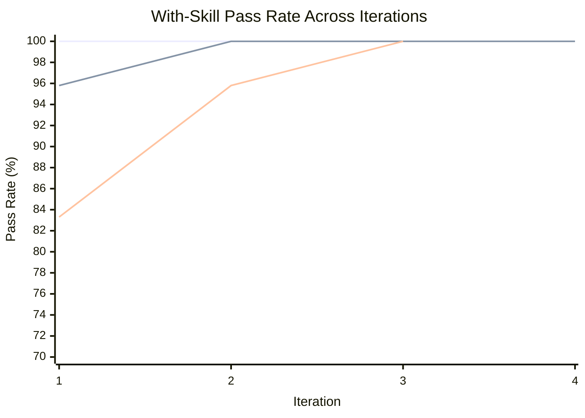

# Example Skills

Skills built with [skill-maker](../README.md), each with full eval-loop
benchmarks demonstrating measurable improvement over unguided agents.

## Quality: Skill-Maker vs No Skill

How much better do agents perform when following a skill-maker-generated skill
vs operating without one?

```mermaid
xychart-beta
    title "Pass Rate: With Skill vs Without Skill"
    x-axis ["Git Commits", "Code Review", "API Docs"]
    y-axis "Pass Rate (%)" 0 --> 100
    bar [100, 100, 100]
    bar [72.3, 41.7, 16.7]
```



> **Legend:** <span style="color: #4CAF50;">&#9632;</span> With Skill
> &nbsp;&nbsp; <span style="color: #FF6B6B;">&#9632;</span> Without Skill

| Skill                                                 | With Skill | Without Skill | Delta      |
| ----------------------------------------------------- | ---------- | ------------- | ---------- |
| [git-conventional-commits](#git-conventional-commits) | 100%       | 72.3%         | **+27.7%** |
| [code-reviewer](#code-reviewer)                       | 100%       | 41.7%         | **+58.3%** |
| [api-doc-generator](#api-doc-generator)               | 100%       | 16.7%         | **+83.3%** |

**Average delta: +56.4%** across all example skills.

## Eval Loop Convergence

How quickly does the skill-maker eval loop converge to a stable pass rate? The
chart below shows each skill's with-skill pass rate across iterations,
demonstrating how the iterative improve-grade-refine cycle drives quality.



> **Legend:** <span style="color: #4CAF50;">&#9632;</span> Git Commits
> &nbsp;&nbsp; <span style="color: #FF6B6B;">&#9632;</span> Code Review
> &nbsp;&nbsp; <span style="color: #00BCD4;">&#9632;</span> API Docs

| Skill                    | Iter 1 | Iter 2 | Iter 3 | Iter 4 | Plateau At |
| ------------------------ | ------ | ------ | ------ | ------ | ---------- |
| git-conventional-commits | 100%   | 100%   | 100%   | -      | 1          |
| code-reviewer            | 95.8%  | 100%   | 100%   | 100%   | 2          |
| api-doc-generator        | 83.3%  | 95.8%  | 100%   | -      | 3          |

**Average iterations to plateau: 2.0** (reaching 100% pass rate).

## Time and Token Cost

Skills improve quality at a cost of additional time and tokens. The tradeoff is
worthwhile: structured output takes longer to produce but is consistently
correct.

```mermaid
xychart-beta
    title "Average Execution Time (seconds)"
    x-axis ["Git Commits", "Code Review", "API Docs"]
    y-axis "Seconds" 0 --> 50
    bar [10.2, 20.3, 43.1]
    bar [5.7, 11.4, 16.9]
```



> **Legend:** <span style="color: #4CAF50;">&#9632;</span> With Skill
> &nbsp;&nbsp; <span style="color: #FF6B6B;">&#9632;</span> Without Skill

| Skill                    | Time (w/ skill) | Time (w/o skill) | Token (w/ skill) | Token (w/o skill) |
| ------------------------ | --------------- | ---------------- | ---------------- | ----------------- |
| git-conventional-commits | 10.2s           | 5.7s             | 5,060            | 3,143             |
| code-reviewer            | 20.3s           | 11.4s            | 4,753            | 2,647             |
| api-doc-generator        | 43.1s           | 16.9s            | 23,367           | 9,100             |

Higher-complexity skills (API docs) show a larger time increase, but also the
largest quality delta (+83.3%).

---

## Built Skills

### git-conventional-commits

Generates conventional commit messages from staged git changes. Classifies
change types, identifies scope, enforces imperative mood, 50-char subject lines,
and BREAKING CHANGE footers.

| Metric                | Value                                                         |
| --------------------- | ------------------------------------------------------------- |
| Final pass rate       | 100%                                                          |
| Baseline pass rate    | 72.3%                                                         |
| Delta                 | +27.7%                                                        |
| Iterations to plateau | 1                                                             |
| Eval cases            | 3 (simple-feature, bugfix-with-breaking, multi-file-refactor) |

**Strongest differentiators:** BREAKING CHANGE footer format (100% failure
without skill), scope in parentheses (78% failure without skill), lowercase
after colon (67% failure without skill).

[Skill directory](git-conventional-commits/) |
[Benchmark details](git-conventional-commits-workspace/FINAL-BENCHMARK.md)

### code-reviewer

Performs structured code reviews with categorized findings, severity levels,
quantified impact analysis, and concrete fix suggestions.

| Metric                | Value                                                                           |
| --------------------- | ------------------------------------------------------------------------------- |
| Final pass rate       | 100%                                                                            |
| Baseline pass rate    | 41.7%                                                                           |
| Delta                 | +58.3%                                                                          |
| Iterations to plateau | 2                                                                               |
| Eval cases            | 3 (sql-injection-review, performance-bottleneck, complex-refactoring-candidate) |

**Strongest differentiators:** Severity classification (always fails without
skill), structured output format (always fails), specific code fix suggestions
(always fails), quantified impact analysis (always fails).

[Skill directory](code-reviewer/) |
[Benchmark details](code-reviewer-workspace/FINAL-BENCHMARK.md)

### api-doc-generator

Generates comprehensive API documentation from source code in both Markdown and
OpenAPI 3.0 JSON format. Covers endpoints, parameters, auth, errors, and
examples.

| Metric                | Value                                                          |
| --------------------- | -------------------------------------------------------------- |
| Final pass rate       | 100%                                                           |
| Baseline pass rate    | 16.7%                                                          |
| Delta                 | +83.3%                                                         |
| Iterations to plateau | 3                                                              |
| Eval cases            | 3 (rest-crud-endpoints, authenticated-api, error-handling-api) |

**Strongest differentiators:** OpenAPI JSON output (never produced without
skill), error response documentation (never produced), per-endpoint auth
indicators (never produced), parameter constraints from validation schemas
(never traced).

[Skill directory](api-doc-generator/) |
[Benchmark details](api-doc-generator-workspace/FINAL-BENCHMARK.md)

---

## Planned Skills

The following skills are scaffolded and ready to be built with skill-maker:

| Skill                                             | Domain                                    | Status  |
| ------------------------------------------------- | ----------------------------------------- | ------- |
| [pdf-tools](pdf-tools/)                           | PDF extraction, form filling, merging     | Planned |
| [image-gif-tools](image-gif-tools/)               | Image/GIF processing with ffmpeg          | Planned |
| [docker-manager](docker-manager/)                 | Container lifecycle management            | Planned |
| [security-analyst](security-analyst/)             | OWASP scanning, secret detection          | Planned |
| [code-refactoring](code-refactoring/)             | Code smell detection, cleanup             | Planned |
| [infrastructure-as-code](infrastructure-as-code/) | Terraform, CloudFormation, Pulumi         | Planned |
| [debugging](debugging/)                           | Systematic debugging, root cause analysis | Planned |

To build any of these, run skill-maker:

```
Create a skill for [description of what the skill should do]
```

The eval loop will produce benchmark data that can be added to the charts above.
