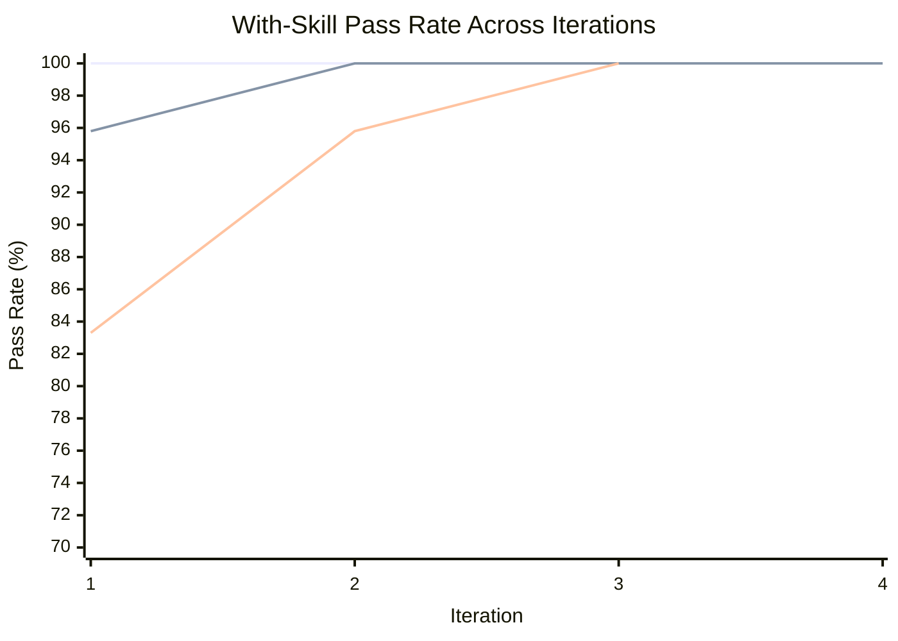

# Example Skills

Skills built with [skill-maker](../README.md), each with full eval-loop
benchmarks demonstrating measurable improvement over unguided agents.

## Quality: Skill-Maker vs No Skill

How much better do agents perform when following a skill-maker-generated skill
vs operating without one?

```mermaid
xychart-beta
    title "Pass Rate: With Skill vs Without Skill"
    x-axis ["Git Commits", "Code Review", "API Docs"]
    y-axis "Pass Rate (%)" 0 --> 100
    bar [100, 100, 100]
    bar [72.3, 41.7, 16.7]
```



> **Legend:** <span style="color: #4CAF50;">&#9632;</span> With Skill
> &nbsp;&nbsp; <span style="color: #FF6B6B;">&#9632;</span> Without Skill

| Skill                                                 | With Skill | Without Skill | Delta      |
| ----------------------------------------------------- | ---------- | ------------- | ---------- |
| [git-conventional-commits](#git-conventional-commits) | 100%       | 72.3%         | **+27.7%** |
| [code-reviewer](#code-reviewer)                       | 100%       | 41.7%         | **+58.3%** |
| [api-doc-generator](#api-doc-generator)               | 100%       | 16.7%         | **+83.3%** |

**Average delta: +56.4%** across all example skills.

## Eval Loop Convergence

How quickly does the skill-maker eval loop converge to a stable pass rate? The
chart below shows each skill's with-skill pass rate across iterations,
demonstrating how the iterative improve-grade-refine cycle drives quality.



> **Legend:** <span style="color: #4CAF50;">&#9632;</span> Git Commits
> &nbsp;&nbsp; <span style="color: #FF6B6B;">&#9632;</span> Code Review
> &nbsp;&nbsp; <span style="color: #00BCD4;">&#9632;</span> API Docs

| Skill                    | Iter 1 | Iter 2 | Iter 3 | Iter 4 | Plateau At |
| ------------------------ | ------ | ------ | ------ | ------ | ---------- |
| git-conventional-commits | 100%   | 100%   | 100%   | -      | 1          |
| code-reviewer            | 95.8%  | 100%   | 100%   | 100%   | 2          |
| api-doc-generator        | 83.3%  | 95.8%  | 100%   | -      | 3          |

**Average iterations to plateau: 2.0** (reaching 100% pass rate).

## Time and Token Cost

Skills improve quality at a cost of additional time and tokens. The tradeoff is
worthwhile: structured output takes longer to produce but is consistently
correct.

```mermaid
xychart-beta
    title "Average Execution Time (seconds)"
    x-axis ["Git Commits", "Code Review", "API Docs"]
    y-axis "Seconds" 0 --> 50
    bar [10.2, 20.3, 43.1]
    bar [5.7, 11.4, 16.9]
```



> **Legend:** <span style="color: #4CAF50;">&#9632;</span> With Skill
> &nbsp;&nbsp; <span style="color: #FF6B6B;">&#9632;</span> Without Skill

| Skill                    | Time (w/ skill) | Time (w/o skill) | Token (w/ skill) | Token (w/o skill) |
| ------------------------ | --------------- | ---------------- | ---------------- | ----------------- |
| git-conventional-commits | 10.2s           | 5.7s             | 5,060            | 3,143             |
| code-reviewer            | 20.3s           | 11.4s            | 4,753            | 2,647             |
| api-doc-generator        | 43.1s           | 16.9s            | 23,367           | 9,100             |

Higher-complexity skills (API docs) show a larger time increase, but also the
largest quality delta (+83.3%).

---

## Built Skills

### git-conventional-commits

Generates conventional commit messages from staged git changes. Classifies
change types, identifies scope, enforces imperative mood, 50-char subject lines,
and BREAKING CHANGE footers.

| Metric                | Value                                                         |
| --------------------- | ------------------------------------------------------------- |
| Final pass rate       | 100%                                                          |
| Baseline pass rate    | 72.3%                                                         |
| Delta                 | +27.7%                                                        |
| Iterations to plateau | 1                                                             |
| Eval cases            | 3 (simple-feature, bugfix-with-breaking, multi-file-refactor) |

**Strongest differentiators:** BREAKING CHANGE footer format (100% failure
without skill), scope in parentheses (78% failure without skill), lowercase
after colon (67% failure without skill).

[Skill directory](git-conventional-commits/) |
[Benchmark details](git-conventional-commits-workspace/FINAL-BENCHMARK.md)

### code-reviewer

Performs structured code reviews with categorized findings, severity levels,
quantified impact analysis, and concrete fix suggestions.

| Metric                | Value                                                                           |
| --------------------- | ------------------------------------------------------------------------------- |
| Final pass rate       | 100%                                                                            |
| Baseline pass rate    | 41.7%                                                                           |
| Delta                 | +58.3%                                                                          |
| Iterations to plateau | 2                                                                               |
| Eval cases            | 3 (sql-injection-review, performance-bottleneck, complex-refactoring-candidate) |

**Strongest differentiators:** Severity classification (always fails without
skill), structured output format (always fails), specific code fix suggestions
(always fails), quantified impact analysis (always fails).

[Skill directory](code-reviewer/) |
[Benchmark details](code-reviewer-workspace/FINAL-BENCHMARK.md)

### api-doc-generator

Generates comprehensive API documentation from source code in both Markdown and
OpenAPI 3.0 JSON format. Covers endpoints, parameters, auth, errors, and
examples.

| Metric                | Value                                                          |
| --------------------- | -------------------------------------------------------------- |
| Final pass rate       | 100%                                                           |
| Baseline pass rate    | 16.7%                                                          |
| Delta                 | +83.3%                                                         |
| Iterations to plateau | 3                                                              |
| Eval cases            | 3 (rest-crud-endpoints, authenticated-api, error-handling-api) |

**Strongest differentiators:** OpenAPI JSON output (never produced without
skill), error response documentation (never produced), per-endpoint auth
indicators (never produced), parameter constraints from validation schemas
(never traced).

[Skill directory](api-doc-generator/) |
[Benchmark details](api-doc-generator-workspace/FINAL-BENCHMARK.md)

---

## Choosing Good Skill Use Cases

Not every task benefits equally from a skill. The best candidates share specific
traits. Here's how to predict whether a skill will produce a high delta (large
improvement over unguided agents) or a low one.

### High-delta traits

Skills with the largest improvement (+50% or more) share these characteristics:

| Trait                                   | Why it matters                                                                | Example                                                        |
| --------------------------------------- | ----------------------------------------------------------------------------- | -------------------------------------------------------------- |
| **Structured output format**            | Agents know the content but won't organize it consistently without a template | API docs, code reviews, PR descriptions                        |
| **Convention-specific rules**           | Agents have general knowledge but miss domain conventions                     | Conventional commits, SemVer changelogs, error code taxonomies |
| **Comprehensive coverage requirements** | Agents address the obvious case and stop; skills enforce exhaustive coverage  | All error codes, all endpoints, all migration rollback steps   |
| **Safety/correctness checklists**       | Agents skip verification steps that prevent production incidents              | Migration rollbacks, data backups, zero-downtime checks        |
| **Multi-artifact output**               | Agents produce one file; skills require coordinated outputs                   | Markdown + OpenAPI JSON, migration + rollback + runbook        |

### Low-delta traits (avoid these)

| Trait                     | Why the skill won't help much                               | Example                                    |
| ------------------------- | ----------------------------------------------------------- | ------------------------------------------ |
| Agents already do it well | Marginal improvement doesn't justify the overhead           | Basic README generation, simple unit tests |
| Subjective quality        | Hard to write objectively verifiable assertions             | "Write better variable names"              |
| Single-step tasks         | No workflow to enforce; the agent gets it right in one shot | "Add a .gitignore"                         |
| Highly context-dependent  | The skill can't anticipate the specific codebase            | "Refactor this code" (too open-ended)      |

### The litmus test

Ask yourself: **"If I gave this task to 10 different agents without guidance,
would they produce 10 different outputs with inconsistent quality?"** If yes,
that's a high-delta skill candidate. If they'd all produce roughly the same
reasonable output, a skill won't add much.

The built examples confirm this pattern:

- **api-doc-generator (+83.3%):** 10 agents would produce 10 different doc
  formats, most missing error responses and auth details
- **code-reviewer (+58.3%):** 10 agents would all find the bug but present
  findings in 10 different formats with inconsistent severity
- **git-conventional-commits (+27.7%):** Lower delta because agents already know
  commit message basics; the skill enforces specific formatting rules

---

## Planned Skills

The following skills are scaffolded and ready to be built with skill-maker. Each
was selected for high predicted delta based on the traits above.

| Skill                                       | Domain                                               | Predicted Delta | Key Trait                 |
| ------------------------------------------- | ---------------------------------------------------- | --------------- | ------------------------- |
| [database-migration](database-migration/)   | Safe, reversible migrations with rollback plans      | +70-80%         | Safety checklists         |
| [pr-description](pr-description/)           | Structured PR descriptions with testing instructions | +60-70%         | Structured output         |
| [error-handling](error-handling/)           | Unified error taxonomy, codes, and propagation       | +65-75%         | Convention-specific rules |
| [changelog-generator](changelog-generator/) | Audience-aware changelogs with SemVer classification | +55-65%         | Comprehensive coverage    |
| [monitoring-setup](monitoring-setup/)       | Health checks, metrics, tracing, and alerts          | +50-60%         | Multi-artifact output     |

To build any of these, run skill-maker:

```
Create a skill for [description of what the skill should do]
```

The eval loop will produce benchmark data that can be added to the charts above.
