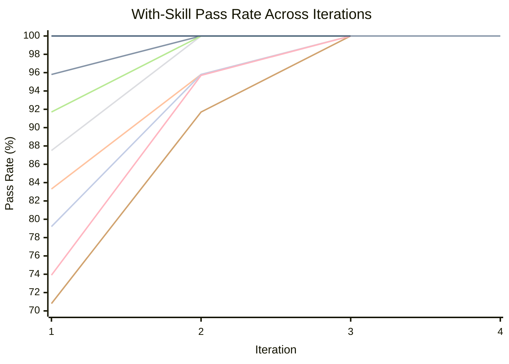

```mermaid
xychart-beta
    title "Pass Rate: With Skill vs Without Skill"
    x-axis ["Git Commits", "Code Review", "API Docs", "DB Migration", "PR Desc", "Errors", "Changelog", "Monitoring", "PDF Toolkit"]
    y-axis "Pass Rate (%)" 0 --> 100
    bar [100, 100, 100, 100, 100, 100, 100, 100, 100]
    bar [72.3, 41.7, 16.7, 4.2, 20.8, 8.3, 20.8, 26.1, 4.2]
```

# Example Skills

Skills built with [skill-maker](../README.md), each with full eval-loop
benchmarks demonstrating measurable improvement over unguided agents.

## Install

Install skill-maker and any example skills with a single command:

```bash
# npx
npx skill-maker install --all

# pnpm
pnpx skill-maker install --all

# bun
bunx skill-maker install --all
```

Or install specific example skills:

```bash
npx skill-maker install pdf-toolkit code-reviewer
```

Run `npx skill-maker list` to see all available skills.

## Quality: Skill-Maker vs No Skill

How much better do agents perform when following a skill-maker-generated skill
vs operating without one?



> **Legend:** <span style="color: #4CAF50;">&#9632;</span> With Skill
> &nbsp;&nbsp; <span style="color: #FF6B6B;">&#9632;</span> Without Skill

| Skill                                                 | With Skill | Without Skill | Delta      |
| ----------------------------------------------------- | ---------- | ------------- | ---------- |
| [git-conventional-commits](#git-conventional-commits) | 100%       | 72.3%         | **+27.7%** |
| [code-reviewer](#code-reviewer)                       | 100%       | 41.7%         | **+58.3%** |
| [api-doc-generator](#api-doc-generator)               | 100%       | 16.7%         | **+83.3%** |
| [database-migration](#database-migration)             | 100%       | 4.2%          | **+95.8%** |
| [pr-description](#pr-description)                     | 100%       | 20.8%         | **+79.2%** |
| [error-handling](#error-handling)                     | 100%       | 8.3%          | **+91.7%** |
| [changelog-generator](#changelog-generator)           | 100%       | 20.8%         | **+79.2%** |
| [monitoring-setup](#monitoring-setup)                 | 100%       | 26.1%         | **+73.9%** |
| [pdf-toolkit](#pdf-toolkit)                           | 100%       | 4.2%          | **+95.8%** |

**Average delta: +76.1%** across all 9 example skills.

## Eval Loop Convergence

How quickly does the skill-maker eval loop converge to a stable pass rate?



> **Legend:** <span style="color: #4CAF50;">&#9632;</span> Git Commits
> &nbsp;&nbsp; <span style="color: #FF6B6B;">&#9632;</span> Code Review
> &nbsp;&nbsp; <span style="color: #00BCD4;">&#9632;</span> API Docs
> &nbsp;&nbsp; <span style="color: #FF9800;">&#9632;</span> DB Migration
> &nbsp;&nbsp; <span style="color: #9C27B0;">&#9632;</span> PR Description
> &nbsp;&nbsp; <span style="color: #795548;">&#9632;</span> Error Handling
> &nbsp;&nbsp; <span style="color: #607D8B;">&#9632;</span> Changelog
> &nbsp;&nbsp; <span style="color: #E91E63;">&#9632;</span> Monitoring
> &nbsp;&nbsp; <span style="color: #3F51B5;">&#9632;</span> PDF Toolkit

| Skill                    | Iter 1 | Iter 2 | Iter 3 | Iter 4 | Plateau At |
| ------------------------ | ------ | ------ | ------ | ------ | ---------- |
| git-conventional-commits | 100%   | 100%   | 100%   | -      | 1          |
| code-reviewer            | 95.8%  | 100%   | 100%   | 100%   | 2          |
| api-doc-generator        | 83.3%  | 95.8%  | 100%   | -      | 3          |
| database-migration       | 87.5%  | 100%   | 100%   | -      | 2          |
| pr-description           | 91.7%  | 100%   | 100%   | -      | 2          |
| error-handling           | 70.8%  | 91.7%  | 100%   | -      | 3          |
| changelog-generator      | 79.2%  | 95.8%  | 100%   | -      | 3          |
| monitoring-setup         | 73.9%  | 95.7%  | 100%   | -      | 3          |
| pdf-toolkit              | 100%   | 100%   | 100%   | -      | 1          |

**Average iterations to plateau: 2.3** (reaching 100% pass rate).

## Time and Token Cost

Skills improve quality at a cost of additional time and tokens. The tradeoff is
worthwhile: structured output takes longer to produce but is consistently
correct.

```mermaid
xychart-beta
    title "Average Execution Time (seconds)"
    x-axis ["Git Commits", "Code Review", "API Docs", "DB Migration", "PR Desc", "Errors", "Changelog", "Monitoring", "PDF Toolkit"]
    y-axis "Seconds" 0 --> 50
    bar [10.2, 20.3, 43.1, 34.5, 29.7, 34.9, 31.4, 44.4, 32.7]
    bar [5.7, 11.4, 16.9, 6.3, 8.3, 15.0, 13.5, 17.9, 19.0]
```



> **Legend:** <span style="color: #4CAF50;">&#9632;</span> With Skill
> &nbsp;&nbsp; <span style="color: #FF6B6B;">&#9632;</span> Without Skill

| Skill                    | Time (w/ skill) | Time (w/o skill) | Token (w/ skill) | Token (w/o skill) |
| ------------------------ | --------------- | ---------------- | ---------------- | ----------------- |
| git-conventional-commits | 10.2s           | 5.7s             | 5,060            | 3,143             |
| code-reviewer            | 20.3s           | 11.4s            | 4,753            | 2,647             |
| api-doc-generator        | 43.1s           | 16.9s            | 23,367           | 9,100             |
| database-migration       | 34.5s           | 6.3s             | 8,290            | 1,443             |
| pr-description           | 29.7s           | 8.3s             | 7,132            | 2,119             |
| error-handling           | 34.9s           | 15.0s            | 15,800           | 6,867             |
| changelog-generator      | 31.4s           | 13.5s            | 14,577           | 6,450             |
| monitoring-setup         | 44.4s           | 17.9s            | 34,133           | 14,833            |
| pdf-toolkit              | 32.7s           | 19.0s            | 8,800            | 6,300             |

Higher-complexity skills (monitoring, API docs) show a larger time increase, but
also the largest quality deltas.

---

## Built Skills

### git-conventional-commits

Generates conventional commit messages from staged git changes. Classifies
change types, identifies scope, enforces imperative mood, 50-char subject lines,
and BREAKING CHANGE footers.

| Metric                | Value                                                         |
| --------------------- | ------------------------------------------------------------- |
| Final pass rate       | 100%                                                          |
| Baseline pass rate    | 72.3%                                                         |
| Delta                 | +27.7%                                                        |
| Iterations to plateau | 1                                                             |
| Eval cases            | 3 (simple-feature, bugfix-with-breaking, multi-file-refactor) |

**Strongest differentiators:** BREAKING CHANGE footer format (100% failure
without skill), scope in parentheses (78% failure without skill), lowercase
after colon (67% failure without skill).

[Skill directory](git-conventional-commits/) |
[Benchmark details](git-conventional-commits-workspace/FINAL-BENCHMARK.md)

### code-reviewer

Performs structured code reviews with categorized findings, severity levels,
quantified impact analysis, and concrete fix suggestions.

| Metric                | Value                                                                           |
| --------------------- | ------------------------------------------------------------------------------- |
| Final pass rate       | 100%                                                                            |
| Baseline pass rate    | 41.7%                                                                           |
| Delta                 | +58.3%                                                                          |
| Iterations to plateau | 2                                                                               |
| Eval cases            | 3 (sql-injection-review, performance-bottleneck, complex-refactoring-candidate) |

**Strongest differentiators:** Severity classification (always fails without
skill), structured output format (always fails), specific code fix suggestions
(always fails), quantified impact analysis (always fails).

[Skill directory](code-reviewer/) |
[Benchmark details](code-reviewer-workspace/FINAL-BENCHMARK.md)

### api-doc-generator

Generates comprehensive API documentation from source code in both Markdown and
OpenAPI 3.0 JSON format. Covers endpoints, parameters, auth, errors, and
examples.

| Metric                | Value                                                          |
| --------------------- | -------------------------------------------------------------- |
| Final pass rate       | 100%                                                           |
| Baseline pass rate    | 16.7%                                                          |
| Delta                 | +83.3%                                                         |
| Iterations to plateau | 3                                                              |
| Eval cases            | 3 (rest-crud-endpoints, authenticated-api, error-handling-api) |

**Strongest differentiators:** OpenAPI JSON output (never produced without
skill), error response documentation (never produced), per-endpoint auth
indicators (never produced), parameter constraints from validation schemas
(never traced).

[Skill directory](api-doc-generator/) |
[Benchmark details](api-doc-generator-workspace/FINAL-BENCHMARK.md)

### database-migration

Writes safe, reversible database migrations with rollback plans, data backup
commands, zero-downtime deployment notes, and index impact analysis.

| Metric                | Value                                                                       |
| --------------------- | --------------------------------------------------------------------------- |
| Final pass rate       | 100%                                                                        |
| Baseline pass rate    | 4.2%                                                                        |
| Delta                 | +95.8%                                                                      |
| Iterations to plateau | 2                                                                           |
| Eval cases            | 3 (add-column-with-default, rename-column-safely, add-index-on-large-table) |

**Strongest differentiators:** Rollback migrations (never produced without
skill), data backup commands (never produced), lock impact analysis (never
produced), zero-downtime deployment notes (never produced), verification queries
(never produced).

[Skill directory](database-migration/) |
[Benchmark details](database-migration-workspace/FINAL-BENCHMARK.md)

### pr-description

Generates structured PR descriptions from branch diffs with context, motivation,
testing instructions, rollback plans, and reviewer guidance.

| Metric                | Value                                                                 |
| --------------------- | --------------------------------------------------------------------- |
| Final pass rate       | 100%                                                                  |
| Baseline pass rate    | 20.8%                                                                 |
| Delta                 | +79.2%                                                                |
| Iterations to plateau | 2                                                                     |
| Eval cases            | 3 (feature-auth-flow, bugfix-race-condition, refactor-database-layer) |

**Strongest differentiators:** Testing instructions with specific steps (always
fails without skill), rollback plan (always fails), motivation section (always
fails), reviewer guidance with security callouts (always fails).

[Skill directory](pr-description/) |
[Benchmark details](pr-description-workspace/FINAL-BENCHMARK.md)

### error-handling

Standardizes error handling across a codebase with a unified error taxonomy,
consistent error codes, proper propagation, and structured logging.

| Metric                | Value                                                                |
| --------------------- | -------------------------------------------------------------------- |
| Final pass rate       | 100%                                                                 |
| Baseline pass rate    | 8.3%                                                                 |
| Delta                 | +91.7%                                                               |
| Iterations to plateau | 3                                                                    |
| Eval cases            | 3 (express-api-errors, python-service-errors, error-response-schema) |

**Strongest differentiators:** Unified error taxonomy (never produced without
skill), stable error codes (never produced), user/internal error separation
(never produced), correlation IDs in structured logging (never produced), error
code registry with 15+ entries (never produced).

[Skill directory](error-handling/) |
[Benchmark details](error-handling-workspace/FINAL-BENCHMARK.md)

### changelog-generator

Generates audience-aware changelogs from git history with SemVer classification,
migration instructions, and grouped categories.

| Metric                | Value                                                         |
| --------------------- | ------------------------------------------------------------- |
| Final pass rate       | 100%                                                          |
| Baseline pass rate    | 20.8%                                                         |
| Delta                 | +79.2%                                                        |
| Iterations to plateau | 3                                                             |
| Eval cases            | 3 (minor-release, major-breaking-release, patch-security-fix) |

**Strongest differentiators:** SemVer classification (always fails without
skill), breaking change migration guides with before/after code (always fails),
audience-appropriate language (always fails), security advisory formatting
(always fails).

[Skill directory](changelog-generator/) |
[Benchmark details](changelog-generator-workspace/FINAL-BENCHMARK.md)

### monitoring-setup

Adds structured observability to services: health checks, metrics, distributed
tracing, alerts, and runbooks.

| Metric                | Value                                                                      |
| --------------------- | -------------------------------------------------------------------------- |
| Final pass rate       | 100%                                                                       |
| Baseline pass rate    | 26.1%                                                                      |
| Delta                 | +73.9%                                                                     |
| Iterations to plateau | 3                                                                          |
| Eval cases            | 3 (express-api-monitoring, microservice-alerts, distributed-tracing-setup) |

**Strongest differentiators:** Liveness/readiness/startup probe distinction
(always fails without skill), Prometheus metrics format (always fails),
SLO-based alert thresholds with burn rates (always fails), correlation ID
propagation across services (always fails), runbook templates (always fails).

[Skill directory](monitoring-setup/) |
[Benchmark details](monitoring-setup-workspace/FINAL-BENCHMARK.md)

### pdf-toolkit

Extracts text, tables, and images from PDFs, OCRs scanned documents, creates
PDFs from text/images/markdown, and merges or splits PDF files using 7 bundled
Bun TypeScript scripts.

| Metric                | Value                                                                           |
| --------------------- | ------------------------------------------------------------------------------- |
| Final pass rate       | 100%                                                                            |
| Baseline pass rate    | 4.2%                                                                            |
| Delta                 | +95.8%                                                                          |
| Iterations to plateau | 1                                                                               |
| Eval cases            | 3 (extract-and-create-report, merge-split-workflow, scanned-pdf-ocr-extraction) |

**Strongest differentiators:** Correct script selection (agents use generic
tools instead of toolkit scripts — always fails without skill), bun run
execution (always fails), --from-markdown flag (always fails), --page-ranges
semicolon syntax (always fails), lowConfidenceWords in OCR output (always
fails), integrated ocr-pdf.ts with --dpi flag (always fails).

[Skill directory](pdf-toolkit/) |
[Benchmark details](pdf-toolkit-workspace/FINAL-BENCHMARK.md)

---

## Choosing Good Skill Use Cases

Not every task benefits equally from a skill. The best candidates share specific
traits. Here's how to predict whether a skill will produce a high delta (large
improvement over unguided agents) or a low one.

### High-delta traits

Skills with the largest improvement (+50% or more) share these characteristics:

| Trait                                   | Why it matters                                                                | Example                                                        |
| --------------------------------------- | ----------------------------------------------------------------------------- | -------------------------------------------------------------- |
| **Structured output format**            | Agents know the content but won't organize it consistently without a template | API docs, code reviews, PR descriptions                        |
| **Convention-specific rules**           | Agents have general knowledge but miss domain conventions                     | Conventional commits, SemVer changelogs, error code taxonomies |
| **Comprehensive coverage requirements** | Agents address the obvious case and stop; skills enforce exhaustive coverage  | All error codes, all endpoints, all migration rollback steps   |
| **Safety/correctness checklists**       | Agents skip verification steps that prevent production incidents              | Migration rollbacks, data backups, zero-downtime checks        |
| **Multi-artifact output**               | Agents produce one file; skills require coordinated outputs                   | Markdown + OpenAPI JSON, migration + rollback + runbook        |

### Low-delta traits (avoid these)

| Trait                     | Why the skill won't help much                               | Example                                    |
| ------------------------- | ----------------------------------------------------------- | ------------------------------------------ |
| Agents already do it well | Marginal improvement doesn't justify the overhead           | Basic README generation, simple unit tests |
| Subjective quality        | Hard to write objectively verifiable assertions             | "Write better variable names"              |
| Single-step tasks         | No workflow to enforce; the agent gets it right in one shot | "Add a .gitignore"                         |
| Highly context-dependent  | The skill can't anticipate the specific codebase            | "Refactor this code" (too open-ended)      |

### The litmus test

Ask yourself: **"If I gave this task to 10 different agents without guidance,
would they produce 10 different outputs with inconsistent quality?"** If yes,
that's a high-delta skill candidate. If they'd all produce roughly the same
reasonable output, a skill won't add much.

The built examples confirm this pattern:

- **database-migration (+95.8%):** Agents produce bare ALTER TABLE with no
  rollback, no backup, no lock analysis — 4.2% baseline pass rate
- **error-handling (+91.7%):** Agents scatter ad-hoc try/catch with no taxonomy,
  no error codes, leaked internals — 8.3% baseline
- **api-doc-generator (+83.3%):** 10 agents would produce 10 different doc
  formats, most missing error responses and auth details
- **pdf-toolkit (+95.8%):** Agents produce competent PDF solutions using generic
  tools, completely missing the toolkit's purpose-built scripts and flags
- **git-conventional-commits (+27.7%):** Lower delta because agents already know
  commit message basics; the skill enforces specific formatting rules
