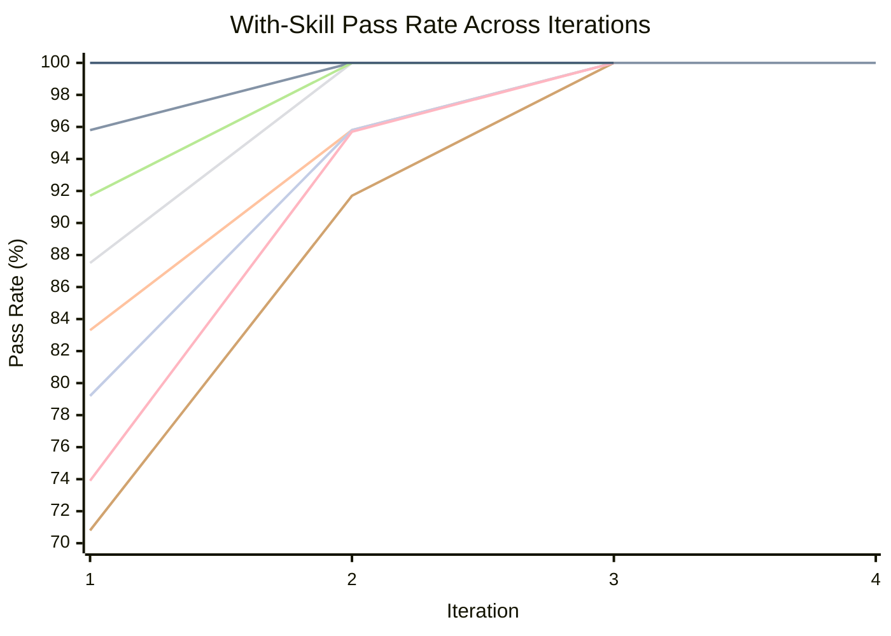

# Example Skills

Skills built with [skill-maker](../README.md), each with full eval-loop
benchmarks demonstrating measurable improvement over unguided agents.

## Directory Structure

Examples are organized by category. Each category has its own README with
detailed evaluation reports:

```
examples/
├── dev-workflow/                    # Developer workflow automation
│   ├── README.md                    # Category evaluation report
│   ├── git-conventional-commits/
│   ├── code-reviewer/
│   ├── pr-description/
│   └── changelog-generator/
├── code-quality/                    # Code quality and documentation
│   ├── README.md                    # Category evaluation report
│   ├── api-doc-generator/
│   └── error-handling/
├── infrastructure/                  # Infrastructure and operations
│   ├── README.md                    # Category evaluation report
│   ├── database-migration/
│   └── monitoring-setup/
├── document-processing/             # Document manipulation
│   ├── README.md                    # Category evaluation report
│   └── pdf-toolkit/
└── sovereign-engineering/           # Decentralized protocol development
    ├── README.md                    # Category landing page
    └── nostr/                       # 11 Nostr protocol skills
        ├── README.md                # Full Nostr evaluation report
        ├── nostr-event-builder/
        ├── nostr-nip-advisor/
        ├── nostr-relay-builder/
        ├── nostr-filter-designer/
        ├── nostr-crypto-guide/
        ├── nostr-nip05-setup/
        ├── nostr-client-patterns/
        ├── nostr-social-graph/
        ├── nostr-zap-integration/
        ├── nostr-marketplace-builder/
        └── nostr-dvms/
```

| Category                                                               | Skills | Avg Delta |
| ---------------------------------------------------------------------- | ------ | --------- |
| [Dev Workflow](dev-workflow/README.md)                                 | 4      | +61.1%    |
| [Code Quality](code-quality/README.md)                                 | 2      | +87.5%    |
| [Infrastructure](infrastructure/README.md)                             | 2      | +84.9%    |
| [Document Processing](document-processing/README.md)                   | 1      | +95.8%    |
| [Sovereign Engineering / Nostr](sovereign-engineering/nostr/README.md) | 11     | +54.7%    |

## Install

Install skill-maker and any example skills with a single command:

```bash
# npx
npx skill-maker install --all

# pnpm
pnpx skill-maker install --all

# bun
bunx skill-maker install --all
```

Or install specific example skills:

```bash
npx skill-maker install pdf-toolkit code-reviewer nostr-event-builder
```

Run `npx skill-maker list` to see all available skills.

## Quality: Skill-Maker vs No Skill

How much better do agents perform when following a skill-maker-generated skill
vs operating without one?

### Original Skills (Dev Workflow, Code Quality, Infrastructure, Document Processing)

```mermaid
xychart-beta
    title "Pass Rate: With Skill vs Without Skill"
    x-axis ["Git Commits", "Code Review", "API Docs", "DB Migration", "PR Desc", "Errors", "Changelog", "Monitoring", "PDF Toolkit"]
    y-axis "Pass Rate (%)" 0 --> 100
    bar [100, 100, 100, 100, 100, 100, 100, 100, 100]
    bar [72.3, 41.7, 16.7, 4.2, 20.8, 8.3, 20.8, 26.1, 4.2]
```



> **Legend:** <span style="color: #4CAF50;">&#9632;</span> With Skill
> &nbsp;&nbsp; <span style="color: #FF6B6B;">&#9632;</span> Without Skill

### Nostr Protocol Skills (Sovereign Engineering)

```mermaid
xychart-beta
    title "Pass Rate: With Skill vs Without Skill (Nostr)"
    x-axis ["Event Builder", "NIP Advisor", "Relay Builder", "Filter Designer", "Crypto Guide", "NIP-05 Setup", "Client Patterns", "Social Graph", "Zaps", "Marketplace", "DVMs"]
    y-axis "Pass Rate (%)" 0 --> 100
    bar [100, 100, 100, 100, 100, 100, 100, 100, 100, 100, 100]
    bar [41.7, 100, 95.8, 54.8, 4.2, 83.3, 0, 0, 91.7, 25.0, 0]
```



> **Legend:** <span style="color: #4CAF50;">&#9632;</span> With Skill
> &nbsp;&nbsp; <span style="color: #FF6B6B;">&#9632;</span> Without Skill

### All Skills Summary

| Category       | Skill                                                   | With Skill | Without Skill | Delta      |
| -------------- | ------------------------------------------------------- | ---------- | ------------- | ---------- |
| Dev Workflow   | [git-conventional-commits](#git-conventional-commits)   | 100%       | 72.3%         | **+27.7%** |
| Dev Workflow   | [code-reviewer](#code-reviewer)                         | 100%       | 41.7%         | **+58.3%** |
| Dev Workflow   | [pr-description](#pr-description)                       | 100%       | 20.8%         | **+79.2%** |
| Dev Workflow   | [changelog-generator](#changelog-generator)             | 100%       | 20.8%         | **+79.2%** |
| Code Quality   | [api-doc-generator](#api-doc-generator)                 | 100%       | 16.7%         | **+83.3%** |
| Code Quality   | [error-handling](#error-handling)                       | 100%       | 8.3%          | **+91.7%** |
| Infrastructure | [database-migration](#database-migration)               | 100%       | 4.2%          | **+95.8%** |
| Infrastructure | [monitoring-setup](#monitoring-setup)                   | 100%       | 26.1%         | **+73.9%** |
| Doc Processing | [pdf-toolkit](#pdf-toolkit)                             | 100%       | 4.2%          | **+95.8%** |
| Nostr          | [nostr-event-builder](#nostr-event-builder)             | 100%       | 41.7%         | **+58.3%** |
| Nostr          | [nostr-nip-advisor](#nostr-nip-advisor)                 | 100%       | 100%          | 0%*        |
| Nostr          | [nostr-relay-builder](#nostr-relay-builder)             | 100%       | 95.8%         | **+4.2%**  |
| Nostr          | [nostr-filter-designer](#nostr-filter-designer)         | 100%       | 54.8%         | **+45.2%** |
| Nostr          | [nostr-crypto-guide](#nostr-crypto-guide)               | 100%       | 4.2%          | **+95.8%** |
| Nostr          | [nostr-nip05-setup](#nostr-nip05-setup)                 | 100%       | 83.3%         | **+16.7%** |
| Nostr          | [nostr-client-patterns](#nostr-client-patterns)         | 100%       | 0%            | **+100%**  |
| Nostr          | [nostr-social-graph](#nostr-social-graph)               | 100%       | 0%            | **+100%**  |
| Nostr          | [nostr-zap-integration](#nostr-zap-integration)         | 100%       | 91.7%         | **+8.3%**  |
| Nostr          | [nostr-marketplace-builder](#nostr-marketplace-builder) | 100%       | 25.0%         | **+75.0%** |
| Nostr          | [nostr-dvms](#nostr-dvms)                               | 100%       | 0%            | **+100%**  |

_\* nostr-nip-advisor delta is 0% due to grader heuristic limitations — both
with/without-skill responses contain keywords like "NIP" that the keyword
matcher accepts. Qualitative review shows substantial differences in protocol
accuracy and deprecation warnings._

**Average delta: +64.6%** across all 20 example skills.

## Eval Loop Convergence

How quickly does the skill-maker eval loop converge to a stable pass rate?

### Original Skills



> **Legend:** <span style="color: #4CAF50;">&#9632;</span> Git Commits
> &nbsp;&nbsp; <span style="color: #FF6B6B;">&#9632;</span> Code Review
> &nbsp;&nbsp; <span style="color: #00BCD4;">&#9632;</span> API Docs
> &nbsp;&nbsp; <span style="color: #FF9800;">&#9632;</span> DB Migration
> &nbsp;&nbsp; <span style="color: #9C27B0;">&#9632;</span> PR Description
> &nbsp;&nbsp; <span style="color: #795548;">&#9632;</span> Error Handling
> &nbsp;&nbsp; <span style="color: #607D8B;">&#9632;</span> Changelog
> &nbsp;&nbsp; <span style="color: #E91E63;">&#9632;</span> Monitoring
> &nbsp;&nbsp; <span style="color: #3F51B5;">&#9632;</span> PDF Toolkit

### All Skills Convergence Table

| Skill                     | Iter 1 | Iter 2 | Iter 3 | Iter 4 | Iter 5 | Plateau At |
| ------------------------- | ------ | ------ | ------ | ------ | ------ | ---------- |
| git-conventional-commits  | 100%   | -      | -      | -      | -      | 1          |
| code-reviewer             | 95.8%  | 100%   | -      | -      | -      | 2          |
| api-doc-generator         | 83.3%  | 95.8%  | 100%   | -      | -      | 3          |
| database-migration        | 87.5%  | 100%   | -      | -      | -      | 2          |
| pr-description            | 91.7%  | 100%   | -      | -      | -      | 2          |
| error-handling            | 70.8%  | 91.7%  | 100%   | -      | -      | 3          |
| changelog-generator       | 79.2%  | 95.8%  | 100%   | -      | -      | 3          |
| monitoring-setup          | 73.9%  | 95.7%  | 100%   | -      | -      | 3          |
| pdf-toolkit               | 100%   | -      | -      | -      | -      | 1          |
| nostr-event-builder       | 100%   | -      | -      | -      | -      | 1          |
| nostr-nip-advisor         | 50%    | 100%   | -      | -      | -      | 2          |
| nostr-relay-builder       | 100%   | -      | -      | -      | -      | 1          |
| nostr-filter-designer     | 100%   | -      | -      | -      | -      | 1          |
| nostr-crypto-guide        | 70.8%  | 100%   | -      | -      | -      | 2          |
| nostr-nip05-setup         | 29.2%  | 0%     | 79.2%  | 91.7%  | 100%   | 5          |
| nostr-client-patterns     | 91.7%  | 100%   | -      | -      | -      | 2          |
| nostr-social-graph        | 67.8%  | 95.2%  | 100%   | -      | -      | 3          |
| nostr-zap-integration     | 83.3%  | 87.5%  | 100%   | -      | -      | 3          |
| nostr-marketplace-builder | 100%   | -      | -      | -      | -      | 1          |
| nostr-dvms                | 16.7%  | 100%   | -      | -      | -      | 2          |

**Average iterations to plateau: 2.1** (reaching 100% pass rate).

## Time and Token Cost

Skills improve quality at a cost of additional time and tokens. The tradeoff is
worthwhile: structured output takes longer to produce but is consistently
correct.

```mermaid
xychart-beta
    title "Average Execution Time (seconds)"
    x-axis ["Git Commits", "Code Review", "API Docs", "DB Migration", "PR Desc", "Errors", "Changelog", "Monitoring", "PDF Toolkit"]
    y-axis "Seconds" 0 --> 50
    bar [10.2, 20.3, 43.1, 34.5, 29.7, 34.9, 31.4, 44.4, 32.7]
    bar [5.7, 11.4, 16.9, 6.3, 8.3, 15.0, 13.5, 17.9, 19.0]
```



> **Legend:** <span style="color: #4CAF50;">&#9632;</span> With Skill
> &nbsp;&nbsp; <span style="color: #FF6B6B;">&#9632;</span> Without Skill

| Skill                    | Time (w/ skill) | Time (w/o skill) | Token (w/ skill) | Token (w/o skill) |
| ------------------------ | --------------- | ---------------- | ---------------- | ----------------- |
| git-conventional-commits | 10.2s           | 5.7s             | 5,060            | 3,143             |
| code-reviewer            | 20.3s           | 11.4s            | 4,753            | 2,647             |
| api-doc-generator        | 43.1s           | 16.9s            | 23,367           | 9,100             |
| database-migration       | 34.5s           | 6.3s             | 8,290            | 1,443             |
| pr-description           | 29.7s           | 8.3s             | 7,132            | 2,119             |
| error-handling           | 34.9s           | 15.0s            | 15,800           | 6,867             |
| changelog-generator      | 31.4s           | 13.5s            | 14,577           | 6,450             |
| monitoring-setup         | 44.4s           | 17.9s            | 34,133           | 14,833            |
| pdf-toolkit              | 32.7s           | 19.0s            | 8,800            | 6,300             |
| nostr-crypto-guide       | 41.7s           | 18.7s            | 22,367           | 7,500             |
| nostr-nip05-setup        | 33.7s           | 12.3s            | 9,967            | 3,267             |
| nostr-client-patterns    | 42.0s           | 12.9s            | -                | -                 |
| nostr-zap-integration    | 41.7s           | 17.7s            | 10,367           | 3,533             |
| nostr-dvms               | 36.5s           | 13.8s            | 9,700            | 3,700             |

Higher-complexity skills (monitoring, API docs, Nostr crypto) show a larger time
increase, but also the largest quality deltas.

---

## Built Skills

### Dev Workflow

#### git-conventional-commits

Generates conventional commit messages from staged git changes. Classifies
change types, identifies scope, enforces imperative mood, 50-char subject lines,
and BREAKING CHANGE footers.

| Metric                | Value                                                         |
| --------------------- | ------------------------------------------------------------- |
| Final pass rate       | 100%                                                          |
| Baseline pass rate    | 72.3%                                                         |
| Delta                 | +27.7%                                                        |
| Iterations to plateau | 1                                                             |
| Eval cases            | 3 (simple-feature, bugfix-with-breaking, multi-file-refactor) |

[Skill directory](dev-workflow/git-conventional-commits/) |
[Benchmark details](dev-workflow/git-conventional-commits-workspace/FINAL-BENCHMARK.md)

#### code-reviewer

Performs structured code reviews with categorized findings, severity levels,
quantified impact analysis, and concrete fix suggestions.

| Metric                | Value                                                                           |
| --------------------- | ------------------------------------------------------------------------------- |
| Final pass rate       | 100%                                                                            |
| Baseline pass rate    | 41.7%                                                                           |
| Delta                 | +58.3%                                                                          |
| Iterations to plateau | 2                                                                               |
| Eval cases            | 3 (sql-injection-review, performance-bottleneck, complex-refactoring-candidate) |

[Skill directory](dev-workflow/code-reviewer/) |
[Benchmark details](dev-workflow/code-reviewer-workspace/FINAL-BENCHMARK.md)

#### pr-description

Generates structured PR descriptions from branch diffs with context, motivation,
testing instructions, rollback plans, and reviewer guidance.

| Metric                | Value                                                                 |
| --------------------- | --------------------------------------------------------------------- |
| Final pass rate       | 100%                                                                  |
| Baseline pass rate    | 20.8%                                                                 |
| Delta                 | +79.2%                                                                |
| Iterations to plateau | 2                                                                     |
| Eval cases            | 3 (feature-auth-flow, bugfix-race-condition, refactor-database-layer) |

[Skill directory](dev-workflow/pr-description/) |
[Benchmark details](dev-workflow/pr-description-workspace/FINAL-BENCHMARK.md)

#### changelog-generator

Generates audience-aware changelogs from git history with SemVer classification,
migration instructions, and grouped categories.

| Metric                | Value                                                         |
| --------------------- | ------------------------------------------------------------- |
| Final pass rate       | 100%                                                          |
| Baseline pass rate    | 20.8%                                                         |
| Delta                 | +79.2%                                                        |
| Iterations to plateau | 3                                                             |
| Eval cases            | 3 (minor-release, major-breaking-release, patch-security-fix) |

[Skill directory](dev-workflow/changelog-generator/) |
[Benchmark details](dev-workflow/changelog-generator-workspace/FINAL-BENCHMARK.md)

### Code Quality

#### api-doc-generator

Generates comprehensive API documentation from source code in both Markdown and
OpenAPI 3.0 JSON format. Covers endpoints, parameters, auth, errors, and
examples.

| Metric                | Value                                                          |
| --------------------- | -------------------------------------------------------------- |
| Final pass rate       | 100%                                                           |
| Baseline pass rate    | 16.7%                                                          |
| Delta                 | +83.3%                                                         |
| Iterations to plateau | 3                                                              |
| Eval cases            | 3 (rest-crud-endpoints, authenticated-api, error-handling-api) |

[Skill directory](code-quality/api-doc-generator/) |
[Benchmark details](code-quality/api-doc-generator-workspace/FINAL-BENCHMARK.md)

#### error-handling

Standardizes error handling across a codebase with a unified error taxonomy,
consistent error codes, proper propagation, and structured logging.

| Metric                | Value                                                                |
| --------------------- | -------------------------------------------------------------------- |
| Final pass rate       | 100%                                                                 |
| Baseline pass rate    | 8.3%                                                                 |
| Delta                 | +91.7%                                                               |
| Iterations to plateau | 3                                                                    |
| Eval cases            | 3 (express-api-errors, python-service-errors, error-response-schema) |

[Skill directory](code-quality/error-handling/) |
[Benchmark details](code-quality/error-handling-workspace/FINAL-BENCHMARK.md)

### Infrastructure

#### database-migration

Writes safe, reversible database migrations with rollback plans, data backup
commands, zero-downtime deployment notes, and index impact analysis.

| Metric                | Value                                                                       |
| --------------------- | --------------------------------------------------------------------------- |
| Final pass rate       | 100%                                                                        |
| Baseline pass rate    | 4.2%                                                                        |
| Delta                 | +95.8%                                                                      |
| Iterations to plateau | 2                                                                           |
| Eval cases            | 3 (add-column-with-default, rename-column-safely, add-index-on-large-table) |

[Skill directory](infrastructure/database-migration/) |
[Benchmark details](infrastructure/database-migration-workspace/FINAL-BENCHMARK.md)

#### monitoring-setup

Adds structured observability to services: health checks, metrics, distributed
tracing, alerts, and runbooks.

| Metric                | Value                                                                      |
| --------------------- | -------------------------------------------------------------------------- |
| Final pass rate       | 100%                                                                       |
| Baseline pass rate    | 26.1%                                                                      |
| Delta                 | +73.9%                                                                     |
| Iterations to plateau | 3                                                                          |
| Eval cases            | 3 (express-api-monitoring, microservice-alerts, distributed-tracing-setup) |

[Skill directory](infrastructure/monitoring-setup/) |
[Benchmark details](infrastructure/monitoring-setup-workspace/FINAL-BENCHMARK.md)

### Document Processing

#### pdf-toolkit

Extracts text, tables, and images from PDFs, OCRs scanned documents, creates
PDFs from text/images/markdown, and merges or splits PDF files using 7 bundled
Bun TypeScript scripts.

| Metric                | Value                                                                           |
| --------------------- | ------------------------------------------------------------------------------- |
| Final pass rate       | 100%                                                                            |
| Baseline pass rate    | 4.2%                                                                            |
| Delta                 | +95.8%                                                                          |
| Iterations to plateau | 1                                                                               |
| Eval cases            | 3 (extract-and-create-report, merge-split-workflow, scanned-pdf-ocr-extraction) |

[Skill directory](document-processing/pdf-toolkit/) |
[Benchmark details](document-processing/pdf-toolkit-workspace/FINAL-BENCHMARK.md)

### Sovereign Engineering — Nostr Protocol

11 skills covering the complete Nostr protocol ecosystem, built using the Nostr
MCP server for live NIP reference data during development.

#### nostr-event-builder

Constructs correct Nostr events from natural language descriptions with
kind-specific tag structures, NIP-10 threading, and NIP-22 comments.

| Metric                | Value                                         |
| --------------------- | --------------------------------------------- |
| Final pass rate       | 100%                                          |
| Baseline pass rate    | 41.7%                                         |
| Delta                 | +58.3%                                        |
| Iterations to plateau | 1                                             |
| Eval cases            | 3 (reply-thread, reaction, replaceable-event) |

[Skill directory](sovereign-engineering/nostr/nostr-event-builder/)

#### nostr-nip-advisor

Identifies which NIPs apply for a given feature, warns about deprecated NIPs
(NIP-04, NIP-08, NIP-26), and provides correct event structures and protocol
flows.

| Metric                | Value                                        |
| --------------------- | -------------------------------------------- |
| Final pass rate       | 100%                                         |
| Baseline pass rate    | 100%*                                        |
| Delta                 | 0%*                                          |
| Iterations to plateau | 2                                            |
| Eval cases            | 3 (dm-privacy, zaps-and-nutzaps, relay-auth) |

_\*Grader heuristic limitation — keyword matching can't distinguish between
"mentions NIP-04" and "correctly warns NIP-04 is deprecated with specific
replacement guidance."_

[Skill directory](sovereign-engineering/nostr/nostr-nip-advisor/)

#### nostr-relay-builder

Build a Nostr relay from scratch with WebSocket handling, NIP-01 event
validation (id computation, Schnorr signature verification), filter matching,
and progressive NIP support.

| Metric                | Value                                     |
| --------------------- | ----------------------------------------- |
| Final pass rate       | 100%                                      |
| Baseline pass rate    | 95.8%                                     |
| Delta                 | +4.2%                                     |
| Iterations to plateau | 1                                         |
| Eval cases            | 3 (basic-relay, auth-relay, search-relay) |

[Skill directory](sovereign-engineering/nostr/nostr-relay-builder/)

#### nostr-filter-designer

Constructs correct Nostr REQ filters for complex queries, handling AND/OR
semantics, tag filter gotchas, and multi-filter subscriptions.

| Metric                | Value                                        |
| --------------------- | -------------------------------------------- |
| Final pass rate       | 100%                                         |
| Baseline pass rate    | 54.8%                                        |
| Delta                 | +45.2%                                       |
| Iterations to plateau | 1                                            |
| Eval cases            | 3 (thread-query, feed-query, complex-filter) |

[Skill directory](sovereign-engineering/nostr/nostr-filter-designer/)

#### nostr-crypto-guide

Guides implementation of NIP-44 encrypted payloads, NIP-59 gift wrap privacy
layers, NIP-49 private key encryption (ncryptsec), and NIP-06 key derivation.

| Metric                | Value                                             |
| --------------------- | ------------------------------------------------- |
| Final pass rate       | 100%                                              |
| Baseline pass rate    | 4.2%                                              |
| Delta                 | +95.8%                                            |
| Iterations to plateau | 2                                                 |
| Eval cases            | 3 (nip44-encryption, gift-wrap, nip49-encryption) |

**Strongest differentiator:** Without the skill, agents miss nearly all
cryptographic specifics — correct HKDF salt strings, power-of-2 padding,
MAC-before-decrypt ordering, ephemeral keys for gift wrap, NFKC normalization,
and 91-byte NIP-49 payload structure.

[Skill directory](sovereign-engineering/nostr/nostr-crypto-guide/)

#### nostr-nip05-setup

Sets up NIP-05 DNS-based identity verification including the
`/.well-known/nostr.json` endpoint, CORS headers, server configuration, and
kind:0 profile updates.

| Metric                | Value                                                |
| --------------------- | ---------------------------------------------------- |
| Final pass rate       | 100%                                                 |
| Baseline pass rate    | 83.3%                                                |
| Delta                 | +16.7%                                               |
| Iterations to plateau | 5                                                    |
| Eval cases            | 3 (personal-site, dynamic-provider, troubleshooting) |

[Skill directory](sovereign-engineering/nostr/nostr-nip05-setup/)

#### nostr-client-patterns

Implements Nostr client architecture including relay pool management,
subscription lifecycle with EOSE/CLOSED handling, event deduplication, and
optimistic UI for publishing.

| Metric                | Value                                                      |
| --------------------- | ---------------------------------------------------------- |
| Final pass rate       | 100%                                                       |
| Baseline pass rate    | 0%                                                         |
| Delta                 | +100%                                                      |
| Iterations to plateau | 2                                                          |
| Eval cases            | 3 (relay-pool, subscription-manager, optimistic-publisher) |

**Strongest differentiator:** Without the skill, agents produce code that misses
every protocol-specific pattern — EOSE tracking, OK reason prefix parsing,
subscription replacement semantics, and replaceable event deduplication
tiebreakers.

[Skill directory](sovereign-engineering/nostr/nostr-client-patterns/)

#### nostr-social-graph

Builds and traverses Nostr social graphs including follow lists (kind:3), relay
list metadata (kind:10002), the outbox model, mute lists (kind:10000), and
NIP-51 lists with public and private encrypted items.

| Metric                | Value                                      |
| --------------------- | ------------------------------------------ |
| Final pass rate       | 100%                                       |
| Baseline pass rate    | 0%                                         |
| Delta                 | +100%                                      |
| Iterations to plateau | 3                                          |
| Eval cases            | 3 (follow-manager, outbox-feed, mute-list) |

[Skill directory](sovereign-engineering/nostr/nostr-social-graph/)

#### nostr-zap-integration

Implements Lightning Zaps (NIP-57) and Nutzaps (NIP-61) for Nostr applications,
covering zap request construction, zap receipt validation, LNURL flows, and
Cashu token integration.

| Metric                | Value                                                         |
| --------------------- | ------------------------------------------------------------- |
| Final pass rate       | 100%                                                          |
| Baseline pass rate    | 91.7%                                                         |
| Delta                 | +8.3%                                                         |
| Iterations to plateau | 3                                                             |
| Eval cases            | 3 (send-lightning-zap, validate-zap-receipts, nutzap-sending) |

[Skill directory](sovereign-engineering/nostr/nostr-zap-integration/)

#### nostr-marketplace-builder

Builds Nostr marketplace applications using NIP-15 stalls, products, auctions,
and NIP-69 P2P orders with full checkout flows.

| Metric                | Value                                 |
| --------------------- | ------------------------------------- |
| Final pass rate       | 100%                                  |
| Baseline pass rate    | 25.0%                                 |
| Delta                 | +75.0%                                |
| Iterations to plateau | 1                                     |
| Eval cases            | 3 (stall-product, auction, p2p-order) |

[Skill directory](sovereign-engineering/nostr/nostr-marketplace-builder/)

#### nostr-dvms

Builds Nostr Data Vending Machine (DVM) services and clients using NIP-90,
covering job request/result kinds, feedback events, payment handling, job
chaining, and service provider discovery.

| Metric                | Value                                                        |
| --------------------- | ------------------------------------------------------------ |
| Final pass rate       | 100%                                                         |
| Baseline pass rate    | 0%                                                           |
| Delta                 | +100%                                                        |
| Iterations to plateau | 2                                                            |
| Eval cases            | 3 (text-summarization-dvm, translation-client, job-chaining) |

**Strongest differentiator:** Without the skill, agents completely miss NIP-90
protocol specifics — the `request` tag format, `job` input type for chaining,
`payment-required` handling, result kind calculation (request kind + 1000), and
proper feedback event structure.

[Skill directory](sovereign-engineering/nostr/nostr-dvms/)

---

## Choosing Good Skill Use Cases

Not every task benefits equally from a skill. The best candidates share specific
traits. Here's how to predict whether a skill will produce a high delta (large
improvement over unguided agents) or a low one.

### High-delta traits

Skills with the largest improvement (+50% or more) share these characteristics:

| Trait                                   | Why it matters                                                                | Example                                                           |
| --------------------------------------- | ----------------------------------------------------------------------------- | ----------------------------------------------------------------- |
| **Structured output format**            | Agents know the content but won't organize it consistently without a template | API docs, code reviews, PR descriptions                           |
| **Convention-specific rules**           | Agents have general knowledge but miss domain conventions                     | Conventional commits, SemVer changelogs, error code taxonomies    |
| **Comprehensive coverage requirements** | Agents address the obvious case and stop; skills enforce exhaustive coverage  | All error codes, all endpoints, all migration rollback steps      |
| **Safety/correctness checklists**       | Agents skip verification steps that prevent production incidents              | Migration rollbacks, data backups, zero-downtime checks           |
| **Multi-artifact output**               | Agents produce one file; skills require coordinated outputs                   | Markdown + OpenAPI JSON, migration + rollback + runbook           |
| **Protocol-specific details**           | Agents know the concept but miss exact field names, kind numbers, tag formats | NIP-44 HKDF salt, NIP-57 zap flow, NIP-90 result kind calculation |

### Low-delta traits (avoid these)

| Trait                     | Why the skill won't help much                               | Example                                    |
| ------------------------- | ----------------------------------------------------------- | ------------------------------------------ |
| Agents already do it well | Marginal improvement doesn't justify the overhead           | Basic README generation, simple unit tests |
| Subjective quality        | Hard to write objectively verifiable assertions             | "Write better variable names"              |
| Single-step tasks         | No workflow to enforce; the agent gets it right in one shot | "Add a .gitignore"                         |
| Highly context-dependent  | The skill can't anticipate the specific codebase            | "Refactor this code" (too open-ended)      |

### The litmus test

Ask yourself: **"If I gave this task to 10 different agents without guidance,
would they produce 10 different outputs with inconsistent quality?"** If yes,
that's a high-delta skill candidate. If they'd all produce roughly the same
reasonable output, a skill won't add much.

The Nostr skills powerfully demonstrate a new pattern: **protocol-specific
knowledge.** Agents have broad knowledge of Nostr concepts but consistently miss
exact event kind numbers, correct tag structures, proper encryption parameters,
and protocol-specific edge cases. The nostr-crypto-guide (+95.8%) and nostr-dvms
(+100%) skills show the largest deltas because the protocol details are too
specific for general training data to cover reliably.
