# Code Quality

Skills for improving code quality through documentation generation and
standardized error handling patterns.

## Skills

| Skill             | With Skill | Without Skill | Delta  | Iterations | Description                                                       |
| ----------------- | ---------- | ------------- | ------ | ---------- | ----------------------------------------------------------------- |
| api-doc-generator | 100%       | 16.7%         | +83.3% | 3          | Generates API docs in Markdown and OpenAPI 3.0 JSON format        |
| error-handling    | 100%       | 8.3%          | +91.7% | 3          | Standardizes error handling with unified taxonomy and error codes |

**Average delta: +87.5%** across code-quality skills.

## Evaluation Results

Each skill was evaluated through the full skill-maker eval loop with isolated
subagent pairs. All skills reached 100% pass rate.

### Pass Rate Comparison

```mermaid
xychart-beta
    title "Pass Rate: With Skill vs Without Skill"
    x-axis ["API Docs", "Error Handling"]
    y-axis "Pass Rate (%)" 0 --> 100
    bar [100, 100]
    bar [16.7, 8.3]
```

> **Legend:** &#9632; With Skill
> &nbsp;&nbsp; &#9632; Without Skill

### Convergence

| Skill             | Iter 1 | Iter 2 | Iter 3 | Plateau At |
| ----------------- | ------ | ------ | ------ | ---------- |
| api-doc-generator | 83.3%  | 95.8%  | 100%   | 3          |
| error-handling    | 70.8%  | 91.7%  | 100%   | 3          |

### Timing

| Skill             | Time (w/ skill) | Time (w/o skill) | Tokens (w/ skill) | Tokens (w/o skill) |
| ----------------- | --------------- | ---------------- | ----------------- | ------------------ |
| api-doc-generator | 43.1s           | 16.9s            | 23,367            | 9,100              |
| error-handling    | 34.9s           | 15.0s            | 15,800            | 6,867              |

## Skill Details

### api-doc-generator

Generates comprehensive API documentation from source code in both Markdown and
OpenAPI 3.0 JSON format. Covers endpoints, parameters, auth, errors, and
examples.

- [Skill directory](api-doc-generator/)
- [Benchmark details](api-doc-generator-workspace/FINAL-BENCHMARK.md)

### error-handling

Standardizes error handling across a codebase with a unified error taxonomy,
consistent error codes, proper propagation, and structured logging.

- [Skill directory](error-handling/)
- [Benchmark details](error-handling-workspace/FINAL-BENCHMARK.md)
