# Dev Workflow

Skills for automating common developer workflow tasks: commit messages, code
reviews, PR descriptions, and changelogs.

## Skills

| Skill                    | With Skill | Without Skill | Delta  | Iterations | Description                                                         |
| ------------------------ | ---------- | ------------- | ------ | ---------- | ------------------------------------------------------------------- |
| git-conventional-commits | 100%       | 72.3%         | +27.7% | 1          | Generates conventional commit messages from staged changes          |
| code-reviewer            | 100%       | 41.7%         | +58.3% | 2          | Structured code reviews with severity levels and fix suggestions    |
| pr-description           | 100%       | 20.8%         | +79.2% | 2          | Generates PR descriptions with context, testing, and rollback plans |
| changelog-generator      | 100%       | 20.8%         | +79.2% | 3          | Audience-aware changelogs with SemVer classification                |

**Average delta: +61.1%** across dev-workflow skills.

## Evaluation Results

Each skill was evaluated through the full skill-maker eval loop with isolated
subagent pairs (with-skill vs without-skill baseline). All skills reached 100%
pass rate.

### Pass Rate Comparison

```mermaid
xychart-beta
    title "Pass Rate: With Skill vs Without Skill"
    x-axis ["Git Commits", "Code Review", "PR Desc", "Changelog"]
    y-axis "Pass Rate (%)" 0 --> 100
    bar [100, 100, 100, 100]
    bar [72.3, 41.7, 20.8, 20.8]
```

> **Legend:** &#9632; With Skill
> &nbsp;&nbsp; &#9632; Without Skill

### Convergence

| Skill                    | Iter 1 | Iter 2 | Iter 3 | Iter 4 | Plateau At |
| ------------------------ | ------ | ------ | ------ | ------ | ---------- |
| git-conventional-commits | 100%   | -      | -      | -      | 1          |
| code-reviewer            | 95.8%  | 100%   | -      | -      | 2          |
| pr-description           | 91.7%  | 100%   | -      | -      | 2          |
| changelog-generator      | 79.2%  | 95.8%  | 100%   | -      | 3          |

### Timing

| Skill                    | Time (w/ skill) | Time (w/o skill) | Tokens (w/ skill) | Tokens (w/o skill) |
| ------------------------ | --------------- | ---------------- | ----------------- | ------------------ |
| git-conventional-commits | 10.2s           | 5.7s             | 5,060             | 3,143              |
| code-reviewer            | 20.3s           | 11.4s            | 4,753             | 2,647              |
| pr-description           | 29.7s           | 8.3s             | 7,132             | 2,119              |
| changelog-generator      | 31.4s           | 13.5s            | 14,577            | 6,450              |

## Skill Details

### git-conventional-commits

Generates conventional commit messages from staged git changes. Classifies
change types, identifies scope, enforces imperative mood, 50-char subject lines,
and BREAKING CHANGE footers.

- [Skill directory](git-conventional-commits/)
- [Benchmark details](git-conventional-commits-workspace/FINAL-BENCHMARK.md)

### code-reviewer

Performs structured code reviews with categorized findings, severity levels,
quantified impact analysis, and concrete fix suggestions.

- [Skill directory](code-reviewer/)
- [Benchmark details](code-reviewer-workspace/FINAL-BENCHMARK.md)

### pr-description

Generates structured PR descriptions from branch diffs with context, motivation,
testing instructions, rollback plans, and reviewer guidance.

- [Skill directory](pr-description/)
- [Benchmark details](pr-description-workspace/FINAL-BENCHMARK.md)

### changelog-generator

Generates audience-aware changelogs from git history with SemVer classification,
migration instructions, and grouped categories.

- [Skill directory](changelog-generator/)
- [Benchmark details](changelog-generator-workspace/FINAL-BENCHMARK.md)
