# Document Processing

Skills for manipulating documents: PDF extraction, creation, merging, splitting,
and OCR.

## Skills

| Skill       | With Skill | Without Skill | Delta  | Iterations | Description                                                  |
| ----------- | ---------- | ------------- | ------ | ---------- | ------------------------------------------------------------ |
| pdf-toolkit | 100%       | 4.2%          | +95.8% | 1          | Extract, create, merge, split PDFs and OCR scanned documents |

**Delta: +95.8%** — one of the highest-impact skills across all examples.

## Evaluation Results

The skill was evaluated through the full skill-maker eval loop with isolated
subagent pairs. It reached 100% pass rate on iteration 1.

### Pass Rate Comparison

```mermaid
xychart-beta
    title "Pass Rate: With Skill vs Without Skill"
    x-axis ["PDF Toolkit"]
    y-axis "Pass Rate (%)" 0 --> 100
    bar [100]
    bar [4.2]
```

> **Legend:** &#9632; With Skill
> &nbsp;&nbsp; &#9632; Without Skill

### Convergence

| Skill       | Iter 1 | Plateau At |
| ----------- | ------ | ---------- |
| pdf-toolkit | 100%   | 1          |

### Timing

| Skill       | Time (w/ skill) | Time (w/o skill) | Tokens (w/ skill) | Tokens (w/o skill) |
| ----------- | --------------- | ---------------- | ----------------- | ------------------ |
| pdf-toolkit | 32.7s           | 19.0s            | 8,800             | 6,300              |

## Skill Details

### pdf-toolkit

Extracts text, tables, and images from PDFs, OCRs scanned documents, creates
PDFs from text/images/markdown, and merges or splits PDF files using 7 bundled
Bun TypeScript scripts.

- [Skill directory](pdf-toolkit/)
- [Benchmark details](pdf-toolkit-workspace/FINAL-BENCHMARK.md)
