# Infrastructure

Skills for infrastructure operations: safe database migrations and production
observability setup.

## Skills

| Skill              | With Skill | Without Skill | Delta  | Iterations | Description                                                                 |
| ------------------ | ---------- | ------------- | ------ | ---------- | --------------------------------------------------------------------------- |
| database-migration | 100%       | 4.2%          | +95.8% | 2          | Safe, reversible migrations with rollback plans and zero-downtime notes     |
| monitoring-setup   | 100%       | 26.1%         | +73.9% | 3          | Structured observability: health checks, metrics, tracing, alerts, runbooks |

**Average delta: +84.9%** across infrastructure skills.

## Evaluation Results

Each skill was evaluated through the full skill-maker eval loop with isolated
subagent pairs. All skills reached 100% pass rate.

### Pass Rate Comparison

```mermaid
xychart-beta
    title "Pass Rate: With Skill vs Without Skill"
    x-axis ["DB Migration", "Monitoring"]
    y-axis "Pass Rate (%)" 0 --> 100
    bar [100, 100]
    bar [4.2, 26.1]
```

> **Legend:** &#9632; With Skill
> &nbsp;&nbsp; &#9632; Without Skill

### Convergence

| Skill              | Iter 1 | Iter 2 | Iter 3 | Plateau At |
| ------------------ | ------ | ------ | ------ | ---------- |
| database-migration | 87.5%  | 100%   | -      | 2          |
| monitoring-setup   | 73.9%  | 95.7%  | 100%   | 3          |

### Timing

| Skill              | Time (w/ skill) | Time (w/o skill) | Tokens (w/ skill) | Tokens (w/o skill) |
| ------------------ | --------------- | ---------------- | ----------------- | ------------------ |
| database-migration | 34.5s           | 6.3s             | 8,290             | 1,443              |
| monitoring-setup   | 44.4s           | 17.9s            | 34,133            | 14,833             |

## Skill Details

### database-migration

Writes safe, reversible database migrations with rollback plans, data backup
commands, zero-downtime deployment notes, and index impact analysis.

- [Skill directory](database-migration/)
- [Benchmark details](database-migration-workspace/FINAL-BENCHMARK.md)

### monitoring-setup

Adds structured observability to services: health checks, metrics, distributed
tracing, alerts, and runbooks.

- [Skill directory](monitoring-setup/)
- [Benchmark details](monitoring-setup-workspace/FINAL-BENCHMARK.md)
