# Nostr Protocol Skills

11 skills covering the complete Nostr protocol ecosystem, built using the
[Nostr MCP server](https://github.com/nostr-protocol/nostr-mcp) for live NIP
reference data during development. All skills reached 100% pass rate through the
[skill-maker](../../../README.md) eval loop.

## Skills

| Skill                                                   | Description                                                                                                                             | With Skill | Without Skill | Delta      | Iterations |
| ------------------------------------------------------- | --------------------------------------------------------------------------------------------------------------------------------------- | ---------- | ------------- | ---------- | ---------- |
| [nostr-event-builder](#nostr-event-builder)             | Constructs correct Nostr events from natural language with kind-specific tag structures, NIP-10 threading, NIP-22 comments              | 100%       | 41.7%         | **+58.3%** | 1          |
| [nostr-nip-advisor](#nostr-nip-advisor)                 | Identifies applicable NIPs, warns about deprecated NIPs (NIP-04, NIP-08, NIP-26), provides correct event structures and protocol flows  | 100%       | 100%*         | 0%*        | 2          |
| [nostr-relay-builder](#nostr-relay-builder)             | Build a relay from scratch with WebSocket handling, NIP-01 event validation (id computation, Schnorr sig verification), filter matching | 100%       | 95.8%         | **+4.2%**  | 1          |
| [nostr-filter-designer](#nostr-filter-designer)         | Constructs correct REQ filters for complex queries, handling AND/OR semantics, tag filter gotchas, multi-filter subscriptions           | 100%       | 54.8%         | **+45.2%** | 1          |
| [nostr-crypto-guide](#nostr-crypto-guide)               | Guides NIP-44 encrypted payloads, NIP-59 gift wrap, NIP-49 ncryptsec, NIP-06 key derivation                                             | 100%       | 4.2%          | **+95.8%** | 2          |
| [nostr-nip05-setup](#nostr-nip05-setup)                 | Sets up NIP-05 DNS-based identity verification, /.well-known/nostr.json endpoint, CORS, server config, kind:0 profile updates           | 100%       | 83.3%         | **+16.7%** | 5          |
| [nostr-client-patterns](#nostr-client-patterns)         | Implements client architecture: relay pool management, subscription lifecycle with EOSE/CLOSED handling, event dedup, optimistic UI     | 100%       | 0%            | **+100%**  | 2          |
| [nostr-social-graph](#nostr-social-graph)               | Builds and traverses social graphs: follow lists (kind:3), relay list metadata (kind:10002), outbox model, mute lists, NIP-51 lists     | 100%       | 0%            | **+100%**  | 3          |
| [nostr-zap-integration](#nostr-zap-integration)         | Implements Lightning Zaps (NIP-57) and Nutzaps (NIP-61): zap request construction, receipt validation, LNURL flows, Cashu tokens        | 100%       | 91.7%         | **+8.3%**  | 3          |
| [nostr-marketplace-builder](#nostr-marketplace-builder) | Builds marketplace apps using NIP-15 stalls/products/auctions and NIP-69 P2P orders with full checkout flows                            | 100%       | 25.0%         | **+75.0%** | 1          |
| [nostr-dvms](#nostr-dvms)                               | Builds Data Vending Machine services/clients using NIP-90: job request/result kinds, feedback events, payment handling, job chaining    | 100%       | 0%            | **+100%**  | 2          |

**Average delta: +54.7%** across 11 Nostr skills.

_\*nostr-nip-advisor: 0% delta is a grader heuristic limitation -- keyword
matching can't distinguish "mentions NIP-04" from "correctly warns NIP-04 is
deprecated with specific replacement guidance." Qualitative review shows
substantial differences in protocol accuracy and deprecation warnings._

## Quality: With Skill vs Without Skill

```mermaid
xychart-beta
    title "Pass Rate: With Skill vs Without Skill (Nostr)"
    x-axis ["Event Builder", "NIP Advisor", "Relay Builder", "Filter Designer", "Crypto Guide", "NIP-05 Setup", "Client Patterns", "Social Graph", "Zaps", "Marketplace", "DVMs"]
    y-axis "Pass Rate (%)" 0 --> 100
    bar [100, 100, 100, 100, 100, 100, 100, 100, 100, 100, 100]
    bar [41.7, 100, 95.8, 54.8, 4.2, 83.3, 0, 0, 91.7, 25.0, 0]
```



> **Legend:** <span style="color: #4CAF50;">&#9632;</span> With Skill
> &nbsp;&nbsp; <span style="color: #FF6B6B;">&#9632;</span> Without Skill

## Eval Loop Convergence

How quickly does the skill-maker eval loop converge to a stable pass rate?

| Skill                     | Iter 1 | Iter 2 | Iter 3 | Iter 4 | Iter 5 | Plateau At |
| ------------------------- | ------ | ------ | ------ | ------ | ------ | ---------- |
| nostr-event-builder       | 100%   | -      | -      | -      | -      | 1          |
| nostr-nip-advisor         | 50%    | 100%   | -      | -      | -      | 2          |
| nostr-relay-builder       | 100%   | -      | -      | -      | -      | 1          |
| nostr-filter-designer     | 100%   | -      | -      | -      | -      | 1          |
| nostr-crypto-guide        | 70.8%  | 100%   | -      | -      | -      | 2          |
| nostr-nip05-setup         | 29.2%  | 0%     | 79.2%  | 91.7%  | 100%   | 5          |
| nostr-client-patterns     | 91.7%  | 100%   | -      | -      | -      | 2          |
| nostr-social-graph        | 67.8%  | 95.2%  | 100%   | -      | -      | 3          |
| nostr-zap-integration     | 83.3%  | 87.5%  | 100%   | -      | -      | 3          |
| nostr-marketplace-builder | 100%   | -      | -      | -      | -      | 1          |
| nostr-dvms                | 16.7%  | 100%   | -      | -      | -      | 2          |

**Average iterations to plateau: 2.0** (reaching 100% pass rate).

Most skills converge in 1-2 iterations. nostr-nip05-setup is the outlier at 5
iterations -- the skill required multiple rounds to correctly enforce CORS
headers, `Access-Control-Allow-Origin` placement, and the interaction between
server configuration and the `/.well-known/nostr.json` endpoint.

## Key Findings

### What agents miss without Nostr skills

Agents have broad knowledge of Nostr concepts but consistently fail on
protocol-specific details. The pattern is clear: agents know _what_ Nostr DMs,
zaps, and DVMs are, but miss the exact implementation details that make them
work.

| Pattern                                                                             | Without Skill        | With Skill                             |
| ----------------------------------------------------------------------------------- | -------------------- | -------------------------------------- |
| Exact event kind numbers (kind:9734 vs kind:9735, kind:5000-5999 vs kind:6000-6999) | Frequently wrong     | Always correct                         |
| Tag structures (`["p", pubkey, relay, role]` vs `["p", pubkey]`)                    | Missing fields       | Complete with all required fields      |
| Encryption parameters (NIP-44 HKDF salt `nip44-v2`, power-of-2 padding)             | Omitted entirely     | Specified with correct values          |
| Protocol edge cases (MAC-before-decrypt, ephemeral keys for gift wrap)              | Never mentioned      | Explicitly handled                     |
| Deprecation awareness (NIP-04, NIP-08, NIP-26)                                      | Uses deprecated NIPs | Warns and provides replacements        |
| Multi-step protocol flows (LNURL callback, zap receipt validation chain)            | Incomplete steps     | Full flow with all intermediate events |

### Highest-delta skills

Four skills show the largest improvements, all sharing the trait of requiring
protocol details too specific for general training data:

- **nostr-crypto-guide (+95.8%)** -- Agents miss nearly all cryptographic
  specifics: correct HKDF salt strings, power-of-2 padding, MAC-before-decrypt
  ordering, ephemeral keys for gift wrap, NFKC normalization, and 91-byte NIP-49
  payload structure.
- **nostr-client-patterns (+100%)** -- Without the skill, agents produce code
  that misses every protocol-specific pattern: EOSE tracking, OK reason prefix
  parsing, subscription replacement semantics, and replaceable event
  deduplication tiebreakers.
- **nostr-social-graph (+100%)** -- Agents fail to implement the outbox model
  correctly, miss the distinction between read/write relay hints in kind:10002,
  and omit NIP-51 private list encryption.
- **nostr-dvms (+100%)** -- Agents completely miss NIP-90 protocol specifics:
  the `request` tag format, `job` input type for chaining, `payment-required`
  handling, result kind calculation (request kind + 1000), and proper feedback
  event structure.

## Time and Token Cost

Skills improve quality at a cost of additional time and tokens. The tradeoff is
consistently worthwhile: protocol-correct output takes longer to produce but
avoids subtle bugs that are expensive to debug later.

| Skill                 | Time (w/ skill) | Time (w/o skill) | Tokens (w/ skill) | Tokens (w/o skill) |
| --------------------- | --------------- | ---------------- | ----------------- | ------------------ |
| nostr-crypto-guide    | 41.7s           | 18.7s            | 22,367            | 7,500              |
| nostr-nip05-setup     | 33.7s           | 12.3s            | 9,967             | 3,267              |
| nostr-client-patterns | 42.0s           | 12.9s            | -                 | -                  |
| nostr-zap-integration | 41.7s           | 17.7s            | 10,367            | 3,533              |
| nostr-dvms            | 36.5s           | 13.8s            | 9,700             | 3,700              |

Skills with cryptographic or multi-step protocol flows (crypto-guide,
zap-integration) show the largest time overhead but also the largest quality
deltas. The average time increase is ~2.5x, while the average quality
improvement is +54.7%.

---

## Built Skills

### nostr-event-builder

Constructs correct Nostr events from natural language descriptions with
kind-specific tag structures, NIP-10 threading, and NIP-22 comments.

| Metric                | Value                                         |
| --------------------- | --------------------------------------------- |
| Final pass rate       | 100%                                          |
| Baseline pass rate    | 41.7%                                         |
| Delta                 | +58.3%                                        |
| Iterations to plateau | 1                                             |
| Eval cases            | 3 (reply-thread, reaction, replaceable-event) |

[Skill directory](nostr-event-builder/) |
[Workspace](nostr-event-builder-workspace/)

### nostr-nip-advisor

Identifies which NIPs apply for a given feature, warns about deprecated NIPs
(NIP-04, NIP-08, NIP-26), and provides correct event structures and protocol
flows.

| Metric                | Value                                        |
| --------------------- | -------------------------------------------- |
| Final pass rate       | 100%                                         |
| Baseline pass rate    | 100%*                                        |
| Delta                 | 0%*                                          |
| Iterations to plateau | 2                                            |
| Eval cases            | 3 (dm-privacy, zaps-and-nutzaps, relay-auth) |

_\*Grader heuristic limitation -- keyword matching can't distinguish between
"mentions NIP-04" and "correctly warns NIP-04 is deprecated with specific
replacement guidance."_

[Skill directory](nostr-nip-advisor/) |
[Workspace](nostr-nip-advisor-workspace/)

### nostr-relay-builder

Build a Nostr relay from scratch with WebSocket handling, NIP-01 event
validation (id computation, Schnorr signature verification), filter matching,
and progressive NIP support.

| Metric                | Value                                     |
| --------------------- | ----------------------------------------- |
| Final pass rate       | 100%                                      |
| Baseline pass rate    | 95.8%                                     |
| Delta                 | +4.2%                                     |
| Iterations to plateau | 1                                         |
| Eval cases            | 3 (basic-relay, auth-relay, search-relay) |

[Skill directory](nostr-relay-builder/) |
[Workspace](nostr-relay-builder-workspace/)

### nostr-filter-designer

Constructs correct Nostr REQ filters for complex queries, handling AND/OR
semantics, tag filter gotchas, and multi-filter subscriptions.

| Metric                | Value                                        |
| --------------------- | -------------------------------------------- |
| Final pass rate       | 100%                                         |
| Baseline pass rate    | 54.8%                                        |
| Delta                 | +45.2%                                       |
| Iterations to plateau | 1                                            |
| Eval cases            | 3 (thread-query, feed-query, complex-filter) |

[Skill directory](nostr-filter-designer/) |
[Workspace](nostr-filter-designer-workspace/)

### nostr-crypto-guide

Guides implementation of NIP-44 encrypted payloads, NIP-59 gift wrap privacy
layers, NIP-49 private key encryption (ncryptsec), and NIP-06 key derivation.

| Metric                | Value                                             |
| --------------------- | ------------------------------------------------- |
| Final pass rate       | 100%                                              |
| Baseline pass rate    | 4.2%                                              |
| Delta                 | +95.8%                                            |
| Iterations to plateau | 2                                                 |
| Eval cases            | 3 (nip44-encryption, gift-wrap, nip49-encryption) |

**Strongest differentiator:** Without the skill, agents miss nearly all
cryptographic specifics -- correct HKDF salt strings, power-of-2 padding,
MAC-before-decrypt ordering, ephemeral keys for gift wrap, NFKC normalization,
and 91-byte NIP-49 payload structure.

[Skill directory](nostr-crypto-guide/) |
[Workspace](nostr-crypto-guide-workspace/)

### nostr-nip05-setup

Sets up NIP-05 DNS-based identity verification including the
`/.well-known/nostr.json` endpoint, CORS headers, server configuration, and
kind:0 profile updates.

| Metric                | Value                                                |
| --------------------- | ---------------------------------------------------- |
| Final pass rate       | 100%                                                 |
| Baseline pass rate    | 83.3%                                                |
| Delta                 | +16.7%                                               |
| Iterations to plateau | 5                                                    |
| Eval cases            | 3 (personal-site, dynamic-provider, troubleshooting) |

[Skill directory](nostr-nip05-setup/) |
[Workspace](nostr-nip05-setup-workspace/)

### nostr-client-patterns

Implements Nostr client architecture including relay pool management,
subscription lifecycle with EOSE/CLOSED handling, event deduplication, and
optimistic UI for publishing.

| Metric                | Value                                                      |
| --------------------- | ---------------------------------------------------------- |
| Final pass rate       | 100%                                                       |
| Baseline pass rate    | 0%                                                         |
| Delta                 | +100%                                                      |
| Iterations to plateau | 2                                                          |
| Eval cases            | 3 (relay-pool, subscription-manager, optimistic-publisher) |

**Strongest differentiator:** Without the skill, agents produce code that misses
every protocol-specific pattern -- EOSE tracking, OK reason prefix parsing,
subscription replacement semantics, and replaceable event deduplication
tiebreakers.

[Skill directory](nostr-client-patterns/) |
[Workspace](nostr-client-patterns-workspace/)

### nostr-social-graph

Builds and traverses Nostr social graphs including follow lists (kind:3), relay
list metadata (kind:10002), the outbox model, mute lists (kind:10000), and
NIP-51 lists with public and private encrypted items.

| Metric                | Value                                      |
| --------------------- | ------------------------------------------ |
| Final pass rate       | 100%                                       |
| Baseline pass rate    | 0%                                         |
| Delta                 | +100%                                      |
| Iterations to plateau | 3                                          |
| Eval cases            | 3 (follow-manager, outbox-feed, mute-list) |

[Skill directory](nostr-social-graph/) |
[Workspace](nostr-social-graph-workspace/)

### nostr-zap-integration

Implements Lightning Zaps (NIP-57) and Nutzaps (NIP-61) for Nostr applications,
covering zap request construction, zap receipt validation, LNURL flows, and
Cashu token integration.

| Metric                | Value                                                         |
| --------------------- | ------------------------------------------------------------- |
| Final pass rate       | 100%                                                          |
| Baseline pass rate    | 91.7%                                                         |
| Delta                 | +8.3%                                                         |
| Iterations to plateau | 3                                                             |
| Eval cases            | 3 (send-lightning-zap, validate-zap-receipts, nutzap-sending) |

[Skill directory](nostr-zap-integration/) |
[Workspace](nostr-zap-integration-workspace/)

### nostr-marketplace-builder

Builds Nostr marketplace applications using NIP-15 stalls, products, auctions,
and NIP-69 P2P orders with full checkout flows.

| Metric                | Value                                 |
| --------------------- | ------------------------------------- |
| Final pass rate       | 100%                                  |
| Baseline pass rate    | 25.0%                                 |
| Delta                 | +75.0%                                |
| Iterations to plateau | 1                                     |
| Eval cases            | 3 (stall-product, auction, p2p-order) |

[Skill directory](nostr-marketplace-builder/) |
[Workspace](nostr-marketplace-builder-workspace/)

### nostr-dvms

Builds Nostr Data Vending Machine (DVM) services and clients using NIP-90,
covering job request/result kinds, feedback events, payment handling, job
chaining, and service provider discovery.

| Metric                | Value                                                        |
| --------------------- | ------------------------------------------------------------ |
| Final pass rate       | 100%                                                         |
| Baseline pass rate    | 0%                                                           |
| Delta                 | +100%                                                        |
| Iterations to plateau | 2                                                            |
| Eval cases            | 3 (text-summarization-dvm, translation-client, job-chaining) |

**Strongest differentiator:** Without the skill, agents completely miss NIP-90
protocol specifics -- the `request` tag format, `job` input type for chaining,
`payment-required` handling, result kind calculation (request kind + 1000), and
proper feedback event structure.

[Skill directory](nostr-dvms/) | [Workspace](nostr-dvms-workspace/)

---

## Install

Install all Nostr skills:

```bash
npx skill-maker install nostr-event-builder nostr-nip-advisor nostr-relay-builder nostr-filter-designer nostr-crypto-guide nostr-nip05-setup nostr-client-patterns nostr-social-graph nostr-zap-integration nostr-marketplace-builder nostr-dvms
```

Or install individual skills:

```bash
npx skill-maker install nostr-crypto-guide nostr-dvms
```

Run `npx skill-maker list` to see all available skills.
