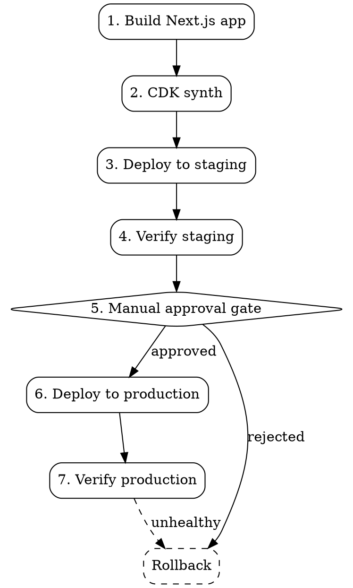

# Next.js CDK Deploy

## Overview

Full workflow for deploying Next.js applications to AWS using CDK with a staging
→ manual approval → production pipeline. Covers building, synthesizing,
deploying, environment config management, and rollback.

**Core principle:** Always deploy to staging first, verify, then promote to
production with an explicit approval gate. Never skip staging. Never deploy
without a rollback plan.

## When to Use

- Deploying a Next.js app (App Router or Pages Router) to AWS
- Setting up CDK infrastructure for Next.js (Lambda@Edge, CloudFront, S3, or
  ECS)
- Creating a staging → production deployment pipeline
- Needing environment-specific configuration (API URLs, feature flags, secrets)
- Implementing rollback after a failed production deployment

**When NOT to use:**

- Deploying to Vercel, Netlify, or non-AWS platforms
- Static-only Next.js exports with no server-side rendering (use S3+CloudFront
  directly)
- Containerized deployments without CDK (use ECS/EKS tooling directly)

## Architecture Quick Reference

| Component          | AWS Service             | Purpose                              |
| ------------------ | ----------------------- | ------------------------------------ |
| Static assets      | S3 + CloudFront         | Cached static files, images, CSS/JS  |
| SSR / API routes   | Lambda (or Lambda@Edge) | Server-side rendering, API handlers  |
| Environment config | SSM Parameter Store     | Per-environment secrets and settings |
| DNS                | Route 53                | Domain routing per environment       |
| CDN                | CloudFront              | Edge caching, HTTPS termination      |
| Monitoring         | CloudWatch              | Logs, alarms, deployment health      |

## Deployment Flow



## Environment Configuration

### Directory Structure

```
project-root/
├── next.config.js          # Next.js config (reads env vars)
├── cdk/
│   ├── bin/app.ts          # CDK app entry point
│   ├── lib/
│   │   ├── nextjs-stack.ts # Main stack definition
│   │   └── config.ts       # Environment config loader
│   └── cdk.json
├── config/
│   ├── staging.env         # Staging environment variables
│   └── production.env      # Production environment variables
├── scripts/
│   ├── deploy.sh           # Main deployment script
│   ├── rollback.sh         # Rollback script
│   └── health-check.sh     # Post-deploy verification
└── .env.local              # Local dev (git-ignored)
```

### Config Loader Pattern (`cdk/lib/config.ts`)

```typescript
import * as dotenv from "dotenv";
import * as path from "path";

export interface EnvConfig {
  stage: "staging" | "production";
  domainName: string;
  certificateArn: string;
  apiUrl: string;
  logLevel: string;
  alarmEmail: string;
}

export function loadConfig(stage: string): EnvConfig {
  const envFile = path.resolve(__dirname, `../../config/${stage}.env`);
  const parsed = dotenv.config({ path: envFile }).parsed;

  if (!parsed) {
    throw new Error(`Missing config file: config/${stage}.env`);
  }

  const required = ["DOMAIN_NAME", "CERTIFICATE_ARN", "API_URL", "ALARM_EMAIL"];
  for (const key of required) {
    if (!parsed[key]) {
      throw new Error(`Missing required config: ${key} in ${stage}.env`);
    }
  }

  return {
    stage: stage as EnvConfig["stage"],
    domainName: parsed.DOMAIN_NAME,
    certificateArn: parsed.CERTIFICATE_ARN,
    apiUrl: parsed.API_URL,
    logLevel: parsed.LOG_LEVEL || "info",
    alarmEmail: parsed.ALARM_EMAIL,
  };
}
```

### Environment File Format (`config/staging.env`)

```bash
DOMAIN_NAME=staging.example.com
CERTIFICATE_ARN=arn:aws:acm:us-east-1:123456789:certificate/abc-123
API_URL=https://api-staging.example.com
LOG_LEVEL=debug
ALARM_EMAIL=team@example.com
```

## CDK Stack Pattern

```typescript
import * as cdk from "aws-cdk-lib";
import * as s3 from "aws-cdk-lib/aws-s3";
import * as cloudfront from "aws-cdk-lib/aws-cloudfront";
import * as lambda from "aws-cdk-lib/aws-lambda";
import * as origins from "aws-cdk-lib/aws-cloudfront-origins";
import { EnvConfig } from "./config";

export class NextjsStack extends cdk.Stack {
  constructor(
    scope: cdk.App,
    id: string,
    config: EnvConfig,
    props?: cdk.StackProps,
  ) {
    super(scope, id, props);

    // S3 bucket for static assets
    const assetsBucket = new s3.Bucket(this, "AssetsBucket", {
      bucketName: `${config.stage}-nextjs-assets`,
      removalPolicy: config.stage === "production"
        ? cdk.RemovalPolicy.RETAIN
        : cdk.RemovalPolicy.DESTROY,
      autoDeleteObjects: config.stage !== "production",
    });

    // Lambda for SSR
    const ssrFunction = new lambda.Function(this, "SSRFunction", {
      runtime: lambda.Runtime.NODEJS_20_X,
      handler: "index.handler",
      code: lambda.Code.fromAsset(".next/standalone"),
      memorySize: 1024,
      timeout: cdk.Duration.seconds(30),
      environment: {
        NODE_ENV: "production",
        API_URL: config.apiUrl,
        LOG_LEVEL: config.logLevel,
        STAGE: config.stage,
      },
    });

    // CloudFront distribution
    const distribution = new cloudfront.Distribution(this, "Distribution", {
      defaultBehavior: {
        origin: new origins.FunctionUrlOrigin(
          ssrFunction.addFunctionUrl({
            authType: lambda.FunctionUrlAuthType.NONE,
          }),
        ),
        viewerProtocolPolicy: cloudfront.ViewerProtocolPolicy.REDIRECT_TO_HTTPS,
        cachePolicy: cloudfront.CachePolicy.CACHING_DISABLED,
      },
      additionalBehaviors: {
        "_next/static/*": {
          origin: new origins.S3BucketOrigin(assetsBucket),
          viewerProtocolPolicy:
            cloudfront.ViewerProtocolPolicy.REDIRECT_TO_HTTPS,
          cachePolicy: cloudfront.CachePolicy.CACHING_OPTIMIZED,
        },
      },
      domainNames: [config.domainName],
    });

    // Outputs for scripts
    new cdk.CfnOutput(this, "DistributionId", {
      value: distribution.distributionId,
    });
    new cdk.CfnOutput(this, "AssetsBucketName", {
      value: assetsBucket.bucketName,
    });
    new cdk.CfnOutput(this, "SSRFunctionName", {
      value: ssrFunction.functionName,
    });
  }
}
```

## Deployment Scripts

Three scripts handle the full workflow. See `scripts/` directory:

| Script            | Purpose                           | Usage                               |
| ----------------- | --------------------------------- | ----------------------------------- |
| `deploy.sh`       | Build, synth, deploy to a stage   | `./scripts/deploy.sh staging`       |
| `rollback.sh`     | Revert to previous Lambda version | `./scripts/rollback.sh production`  |
| `health-check.sh` | Verify deployment health          | `./scripts/health-check.sh staging` |

### Deployment Workflow Commands

```bash
# 1. Deploy to staging
./scripts/deploy.sh staging

# 2. Verify staging
./scripts/health-check.sh staging

# 3. Manual approval (human decision point)
read -p "Staging verified. Deploy to production? (yes/no): " approval

# 4. Deploy to production
if [ "$approval" = "yes" ]; then
  ./scripts/deploy.sh production
  ./scripts/health-check.sh production
fi
```

## Rollback Procedures

### Quick Rollback (Lambda version revert)

```bash
./scripts/rollback.sh production
```

This reverts the Lambda function to its previous published version using
aliases. Fastest recovery — takes ~30 seconds.

### Full Rollback (CDK stack revert)

```bash
# Find the last known-good commit
git log --oneline cdk/

# Check out that commit's CDK code
git checkout <good-commit> -- cdk/

# Rebuild and redeploy
./scripts/deploy.sh production
```

### CloudFront Cache Invalidation

After any rollback, invalidate the CDN cache:

```bash
DISTRIBUTION_ID=$(aws cloudformation describe-stacks \
  --stack-name NextjsStack-production \
  --query "Stacks[0].Outputs[?OutputKey=='DistributionId'].OutputValue" \
  --output text)

aws cloudfront create-invalidation \
  --distribution-id "$DISTRIBUTION_ID" \
  --paths "/*"
```

## Common Mistakes

| Mistake                                             | Fix                                                                               |
| --------------------------------------------------- | --------------------------------------------------------------------------------- |
| Deploying to production without staging             | Always run `deploy.sh staging` first and verify                                   |
| Forgetting `output: 'standalone'` in next.config.js | Required for Lambda deployment — add it                                           |
| Not setting `CERTIFICATE_ARN` for us-east-1         | CloudFront requires ACM certs in us-east-1 regardless of stack region             |
| Skipping CloudFront invalidation after deploy       | Static assets may serve stale content — always invalidate                         |
| Hardcoding env vars in CDK stack                    | Use `config/` env files and the config loader pattern                             |
| No Lambda versioning                                | Enable `currentVersionOptions` for rollback capability                            |
| Deploying SSR bundle without `node_modules`         | `standalone` output includes deps — verify `.next/standalone/node_modules` exists |

## Pre-Deploy Checklist

- [ ] `next.config.js` has `output: 'standalone'`
- [ ] Environment config file exists in `config/<stage>.env`
- [ ] All required env vars are set (DOMAIN_NAME, CERTIFICATE_ARN, API_URL,
      ALARM_EMAIL)
- [ ] ACM certificate is in `us-east-1`
- [ ] AWS credentials configured for target account
- [ ] Previous deployment version noted (for rollback)
- [ ] Health check endpoint exists (e.g., `/api/health`)
